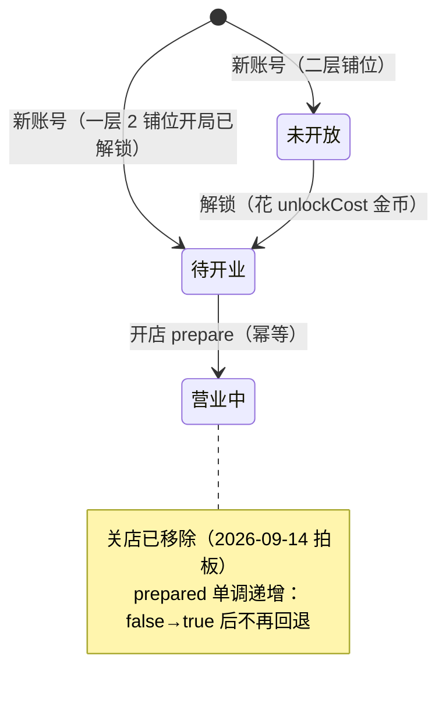

# 《街角百货铺》系统 GDD · 经营与成长

> **阶段**：Phase 2 系统设计（**首份**）
> **作者**：文策渊（design-strategist）
> **版本**：v1.4 · 2026-09-14（v1.3 → v1.4：修 N-3「合法档位集合」算术重述下界、N-7 §8.2 D-04 触发点数；v1.2 → v1.3：补 N-2 首个分段时机、C3-10 `unlockedSlots` 规格、C3-6/C3-7；v1.1 → v1.2：统一 C3-3 口径、定义 `dailyVisitorCap` 的「未冻结」状态）
> **Task**：SC-P2-001（优先级 P0，阻塞 M02）· v1.1 修订：SC-P2-003 · v1.2 修订：SC-P2-004 · v1.3 修订：SC-P2-005 · v1.4 修订：SC-P2-006
> **结构来源**：本文档采用**概念文档附录 A.4 定义的「逐系统 GDD 八节结构」**（A.5 明确引用该结构）——
> 概述 / 机制 / 数据 / 公式 / 边缘情况 / UI 接口 / 依赖 / 验收标准。
> （任务书给出的备选骨架「概述/玩家意图/输入输出/…」仅在 A.5 未给出八节名称时启用；此处 A.4 已给出名称，故以 A.4 为准。）
> **覆盖范围**：**仅 M02 后端扩展所覆盖的系统** = 概念文档 A.5 拆分清单中的 **G1 铺位与解锁 / G2 店铺经营与升级 / G3 客流 / G4 收益与结算 / G5 经济与平衡**。
> **不覆盖**：G6 业务日与离线、G7 好友排行榜、G8 主界面 IA/UX、G9 表现与反馈、G10 新手引导——由后续任务补齐。
> **上游输入**：`design/concept/概念文档.md`（A.5 拆分清单、玩家动词、MDA）、`design/gdd/玩法与技术方案（草案）.md`（**仅 A 部分**）、`design/gdd/需求文档.md`（R-01~R-08）、`docs/architecture/adr/0002·0003·0004`、`production/开发规划文档.md`（M02 一节）、`docs/M01-本地开发后端.md`、`docs/architecture/架构现状.md`、`config/development.json`。
> **下游**：M02 服务端实现（程基岩 / engineering-lead）、M04 客户端、M06 页面与弹窗、后续 G6/G8/G9 GDD。
> **边界**：本文档只做**「把已拍板的规则写成可实现的系统规格」**——不新增玩法机制、不写代码、不写技术架构（B 部分归程基岩）、不评美术。
> **数值状态**：全部数值为**开发期初版**，一律以 **config 键名**引用（ADR 0004）；最终数值以 G5 定稿为准。
>
> **v1.1 修订记录（2026-09-14，SC-P2-003）**：依据 `docs/M02-验收口径评审.md`（SC-M02-QA-001，M02 开工前评审）与用户四项拍板，补齐 4 项 P0 缺陷，并对齐 `开发规划文档` v1.2。
>
> | 决策 | 内容 | 落点 |
> | --- | --- | --- |
> | **C3-3** | 当日客流上限冻结时机改为「**首次实际产生客人的结算**」（`openShopCount ≥ 1`）；0 店开业不冻结、不落盘 | §1.4、§2.3、§3.5、§4.1、§5.3、§8.2 |
> | **C1-1** | 重复解锁 = **幂等成功**（`changed=false`，不重复扣费、不写存档） | §1.4、§2.2、§5.1 |
> | **C3-11** | **禁止升级「待开业」店铺**（必须先开业），错误码 `SHOP_NOT_OPEN` | §1.4、§2.4、§5.2 |
> | **C3-4** | 定义**空段**（`visitors == 0`）语义：**允许存在** | §4.3、§5.6 |
> | **C3-1** | 金币下界不变量 `coins >= initialCoins` → **`coins >= 0`**（否则消费即毁档） | §4.4、§5.5、§8.2 |
> | **C3-2** | 解锁 / 升级与 `prepare` 共用同一互斥锁 + "先落盘再发布"原子语义 | §1.4、§2.4、§5.2 |
> | 类 2 | §8.1 验收对应表同步 `开发规划文档` v1.2 的 **11 条**；附录 A③/A④ 的过期表述更新 | §8.1、附录 A |
>
> **v1.2 修订记录（2026-09-14，SC-P2-004）**：quality-lead 复核追加 2 项阻塞（均因 v1.1 改动引入），本次修复。
>
> | 阻塞 | 处置 | 落点 |
> | --- | --- | --- |
> | **N-1** C3-3 口径自相矛盾 | 五处（§2.3 / §3.5 / §4.1 / §5.3 / §8.2）逐一对齐；§4.1 公式加"仅在冻结时求值"前提，消除 0 店处取值歧义 | §2.3、§3.5、§4.1、§5.1、§5.3、§8.1、§8.2 |
> | **N-2** `dailyVisitorCap`「未冻结」状态未定义 | 新增 §5.7 完整规格（表示方式 `capFrozen` / 落盘 / 校验 / 接口四项），并同步 §5.3、§5.5 校验表、§6.1 接口、§7.2、§8.2 | §5.3、§5.5、§5.7、§6.1、§7.2、§8.2 |
>
> **v1.3 修订记录（2026-09-14，SC-P2-005）**：收口 `docs/M02-验收口径评审.md` §6.3 复核发现的剩余缺口（N-2 首个分段时机、C3-10 `unlockedSlots` 规格）与 §6.5「可并行」两项（C3-6 满铺不可逆、C3-7 段数上界）。**本轮不改价**（§3.6 口径问题按用户拍板留待 G5，附录 B 处理方式不变）。
>
> | 缺口 | 处置 | 落点 |
> | --- | --- | --- |
> | **N-2** 首个分段创建时机 + `prepare` 补齐整层的段次序 | §4.3 补「开店（`prepare`）」为第 3 个分段触发点，并写死 `prepare` 硬顺序（置 `prepared` → 重算满铺 → 建/append 段）；明确触发满铺的新开业店**只产生一条 bonus 价段**、无 spurious pre-bonus 空段 | §4.3、§5.4、§5.6 |
> | **C3-10** `unlockedSlots` 表示与校验未定义 | 新增序列化规格（有序数组 / 升序 / 去重）与加载校验（未知 / 跳序 / 重复 / 数量边界） | §3.1、§3.7、§5.5、§6.1 |
> | **C3-6** 「满铺 → 不满」未声明为不可能 | §5.4 显式声明满铺不可逆（由 `prepared` / `unlockedSlots` 单调性保证） | §5.4 |
> | **C3-7** 每店分段数无具体上界 | §4.3 / §5.6 给出上界 **≤ 1（初始）+ 4（升级）+ 1（满铺）= 6 段/店** | §4.3、§5.6 |
>
> **v1.4 修订记录（2026-09-14，SC-P2-006）**：清理 `docs/M02-验收口径评审.md` §7 复核发现的 9 项 P2 一致性问题中归本文件的 2 项（N-3 / N-7）。均**不阻塞放行、不改任何验收判定**；**本轮不改价**。
>
> | 缺口 | 处置 | 落点 |
> | --- | --- | --- |
> | **N-3** §5.7.3「合法档位集合」等价算术重述**下界写错** | 原写 `baseVisitors ≤ dailyVisitorCap ≤ …`，会放行 `k = 0`（即 `v == baseVisitors`）；但集合 `{ base + per × k \| k ∈ [1,5] }` **排除 `k = 0`**，且冻结前提 `openShopCount ≥ 1` 蕴含 `k ≥ 1`。下界改为 `baseVisitors + visitorsPerShop × 1`，并补 ⚠️ 说明。**措辞与 `docs/architecture/adr/0003-*.md` 增补节逐字一致** | §5.7.3 |
> | **N-7** §8.2 D-04 仍写「两个触发点」 | 与 §4.3 已改的「三个分段触发点（开店 / 升级 / 满铺变化）」对齐，统一为「三个」 | §8.2 |

---

## 1. 概述

### 1.1 一句话

**玩家花金币把铺位从「未开放」变成「营业中」，再花金币把已开业的店从 Lv1 升到 Lv5；每多一家开业的店，当天能接待的客人上限就高一档，每家店每接待一位客人就产生一次收益——直到当天客流走完。**

### 1.2 系统范围与 A.5 映射

| A.5 编号 | 系统 | 本文档覆盖 | 对应 M02 交付物 |
| --- | --- | --- | --- |
| **G1** | 铺位与解锁系统 | ✅ | 解锁接口、`unlockedSlots`、解锁价格与顺序 |
| **G2** | 店铺经营与升级系统 | ✅（**不含关店**） | 开店（沿用 M01 `prepare`）、升级接口、`level` |
| **G3** | 客流系统 | ✅ | 动态客流上限、`dailyVisitorCap`、轮询顺序 |
| **G4** | 收益与结算系统 | ✅ | 等级单价、满铺加成、账单分段 |
| **G5** | 经济与平衡系统 | ✅（汇总校验） | 定价、回本、反向激励复核 |
| G6–G10 | 业务日/排行/UX/表现/引导 | ❌ 后续任务 | — |

> **为什么这 5 个系统合成一份文档**：M02 是一个模块（《开发规划文档》第三节），它一次落地 A2–A5 的全部规则。G1–G5 的**数据互相咬合**（解锁价 → 客流上限 → 收益 → 回本），拆成 5 份会导致同一个数值表在 5 处各写一遍、互相漂移。合为一份、内部按系统分节，是这一模块范围内的正确粒度。后续若 G5 需要独立做数值平衡，可从本文件 §4/§3 抽出成独立 GDD。

### 1.3 与设计支柱的对齐（概念文档 §1）

| 支柱 | 本系统如何支撑 | 风险 |
| --- | --- | --- |
| **P1 零负债** | 无失败态：解锁失败=零变化、升级失败=零变化、金币永不归零；关店已移除，玩家没有"自伤入口" | — |
| **P2 一屏看懂** | 满铺加成用**固定 +1**（整数、无小数、无四舍五入）；客流上限整数线性增长 | 满铺加成"是否生效"需要 UI 明示，否则玩家看不懂（见 §6） |
| **P3 慢慢变好** | 客流随店铺增长，**消除反向激励**（见 §4.4 复核，已用数据验证）；升级有四级可见回报（A3） | **满级后金币无出口 = 已知缺口**（见 §8.4，不掩盖） |
| **P4 克制的在场感** | 本系统不产生任何社交义务 | — |

### 1.4 已拍板决策清单（本文件必须与之一致，不得冲突）

1. 金币出口**只有两个**：解锁铺位 + 升级店铺。**关店功能已移除**。
2. 铺位只有三态：**未开放 / 待开业 / 营业中**。
3. 一层 2 店开局已解锁；二层 3 铺位从左到右逐店解锁，价格 衣橱 600 / 甜屋 800 / 书店 1200。
4. 客流上限 = 基础 20 + 已开业店铺数 × 15。
5. 满铺加成 v1 = 同层满铺则该层单客收益 **+1 金币（固定加值，不是百分比）**。
6. **无失败态**：没有破产/倒闭/差评，唯一"惩罚"是慢一点。
7. 轮询顺序 = **一层临街优先**：`咖啡 → 花束 → 衣橱 → 甜屋 → 书店`。
8. **已知缺口保留**：满级之后金币没有出口（§8.4 显式记录，不发明解决方案掩盖）。

**M02 实现层硬约束（2026-09-14 追加拍板，见头部修订记录）：**

9. **冻结时机**：当日客流上限在「**首次实际产生客人的结算**」（`openShopCount ≥ 1`）时冻结；0 店开业**不冻结、不落盘**（"未冻结"状态用 `capFrozen` 标志表示，见 §5.7）。
10. **解锁幂等**：重复解锁已解锁铺位 = **幂等成功**（`changed=false`，不重复扣费、不写存档）。
11. **升级前置**：**禁止升级「待开业」店铺**，必须先开业（返回 `SHOP_NOT_OPEN`）。
12. **并发原子性**：解锁 / 升级与 `prepare` **共用同一套互斥锁 + "先落盘再发布、失败回滚"**语义（M01 已具备，v2 必须显式扩展，不得默认继承）。

---

## 2. 机制（Mechanics）

### 2.1 铺位三态与状态机（G1 + G2 合体）

铺位（slot）与店铺（shop）在 v1 **一对一固定绑定**（A2）。三态由两个正交字段决定：`slot 是否已解锁` × `shop.prepared 是否为真`。



| 状态 | 判定 | 是否接待客人 | 是否计入客流上限 | 是否参与满铺判定 |
| --- | --- | --- | --- | --- |
| **未开放** | `slot ∉ unlockedSlots` | 否 | 否 | 否（该层不可能满铺） |
| **待开业** | `slot ∈ unlockedSlots ∧ ¬shop.prepared` | 否 | 否 | 否（拖累该层满铺） |
| **营业中** | `slot ∈ unlockedSlots ∧ shop.prepared` | 是 | 是（+1 店） | 是 |

- **单调性约束（硬约束，不得违反）**：`shop.prepared` 只可能 `false → true`，永不回退；`unlockedSlots` 只增不减。这是 M01 存档自证基线的延续（架构现状 §3），也是"关店移除"后的必然结果。
- **未开放 ⇒ 未开业**：未解锁铺位不可能 `prepared`（`prepare` 对未解锁铺位返回 `SLOT_LOCKED`）。因此 M01 的「未准备店铺不得有累计客流」不变量**继续成立，无需放宽**（详见 §5.5 与附录 A 冲突③）。

### 2.2 解锁规则（G1）

1. 一层 2 铺位（`f1-s1`/`f1-s2`）**开局已解锁**，`unlockCost = 0`。
2. 二层 3 铺位**必须从左到右依次解锁**，不能跳过中间（`unlockOrder = 1,2,3`）。
3. 解锁是**一次性主动花费**：`coins -= unlockCost`，`spent += unlockCost`，`unlockedSlots += slotId`。
4. **重复解锁 = 幂等成功**（2026-09-14 拍板，C1-1）：对已解锁铺位再次解锁，返回 `changed=false`，**不重复扣费、不写存档**（与 M01 `prepare` 的幂等语义一致）。
5. 解锁后该铺位变「待开业」，玩家再执行开店才变「营业中」。
6. 解锁**不影响当天客流上限**（上限由"已开业店铺数"决定；一旦当日已冻结则不变，见 §2.3）。

### 2.3 客流规则（G3）

1. **到店节奏**：每 `visitorIntervalSeconds`（初版 5 秒）产生一位客人。不足一个间隔的时间余量**结转到下一次结算**，不丢弃（M01 已实现）。
2. **每日客流上限**（冻结值）：
   `dailyVisitorCap = baseVisitors + visitorsPerShop × 当日已开业店铺数`
   —— 在**当日首次「实际产生客人」的结算时**确定并写死当日值（`dailyVisitorCap` 落盘）。即冻结前提为 `openShopCount ≥ 1`；**0 店开业时上限不冻结、不落盘**（无店可接待客人，本轮结算不产生任何收益，也就没有"当日上限"可言）。**「未冻结」的表示方式见 §5.7（存档）与 §6.1（接口）。**
   > **为什么不是"当日首次结算"（2026-09-14 修正，C3-3）**：客户端进入主界面后每 5 秒轮询一次结算，会**先于玩家开店**触发当日首次结算。若按"首次结算即冻结"，新账号开局 `openShopCount = 0`，上限会被冻成 `baseVisitors = 20`，与"开局 2 店全开 = 50"（§3.6）自相矛盾，玩家也永远看不到正确的 HUD 分母。因此冻结必须等到**真的有人开店、且真的开始接待客人**。
   > **与 ADR 0003「当日冻结」精神一致**：ADR 0003 的核心诉求是"一旦有店开业，当日上限即锁定，中途再开店仍次日生效"，避免"当天开店回溯性改变当日上限"。本次修正只是把"锁定时刻"从"首次结算"**精确到"首次产生客人的结算"**，**不改变** ADR 0003 的冻结语义与"次日生效"结论。
3. **当日中途开店不补当天客流，次日生效**（R-05 / ADR 0003）。
4. **轮询顺序 = 一层临街优先**，由 `shops` 数组顺序决定：
   `咖啡 → 花束 → 衣橱 → 甜屋 → 书店`，**跳过未开业的店铺**。
   > ⚠️ **与 M01 现状的差异**：`config/development.json` 的 `shops` 数组当前是「衣橱→甜屋→书店→咖啡→花束」（二层在前）。M02 **必须把数组顺序改为一层优先**。轮询顺序由数组顺序决定，**不要另写一份顺序配置**（草案 A4）。
5. **跨业务日只刷新当天客流**，不补算离线历史客流，也不扣任何东西（A6 / M01 已实现）。
6. 轮询游标指向**已开业**店铺；未解锁/未开业店铺被跳过（M01 已有"跳过未准备店铺"的游标逻辑，v2 继续沿用）。

### 2.4 开店与升级（G2）

1. **开店（沿用 M01 `prepare`）**：把「待开业」变「营业中」。重复开店**无副作用**（`changed=false`，不写存档）。开店要求铺位已解锁，否则 `SLOT_LOCKED`。
2. **升级**：每家店 `level ∈ [1,5]`，初始 Lv1。升级消耗 `upgradeCost[level→level+1]`，提升该店**基础单价**（见 §3.2 等级单价表）。
   - **前置条件（2026-09-14 拍板，C3-11）**：升级要求店铺处于**「营业中」**。对**「待开业」**店铺升级**被拒绝**，返回新错误码 **`SHOP_NOT_OPEN`**，状态零变化。
   - **为什么用新码 `SHOP_NOT_OPEN` 而非复用现有码**：现有码集合里 `SLOT_LOCKED`（铺位未解锁）、`MAX_LEVEL`（已满级）、`INSUFFICIENT_COINS`（金币不足）都无法准确表达"已解锁、未开业、不能升级"这一状态；复用 `SLOT_LOCKED` 会把"未解锁"与"已解锁未开业"两种不同原因混为一谈，客户端无法给出正确提示（"先解锁"与"先开业"是两句不同的话）。新增一个语义精确的码，代价只是一个枚举值。
3. **升级不追溯**：升级只影响**此后新增**的账单分段；历史分段的 `unitPrice` 与 `revenue` 原样保留（R-07）。
4. **升级的可见回报**（2026-09-14 拍板，A3）：四个等级各对应一次场景变化（Lv2 橱窗暖光 / Lv3 招牌小彩灯 / Lv4 门口花箱 / Lv5 招牌描金边），由客户端承担，本 GDD 只登记"升级 ⇒ 客户端应触发一次可见变化"这一契约（见 §6）。
5. **无"关店"**：不存在"营业中 → 待开业"的转移，也没有对应接口与错误码。
6. **并发与原子性（2026-09-14 拍板，C3-2）**：解锁、升级两类写操作**必须与 `prepare` 走同一套**互斥锁 + "先落盘再发布、失败回滚"的原子语义（M01 的 `Service.mu` + `mutate` 已具备，v2 需**显式扩展**，不得默认继承）。并发发起同一解锁/升级只提交一次、不重复扣费（M07 验收「并发不重复扣费」的实现层保证）。

### 2.5 收益与满铺加成（G4）

```
单客收益(shop) = 等级单价[shop][level] + 满铺加成(shop.floor)
满铺加成(floor) = fullFloorBonus  if 该层所有铺位都已解锁且都已开业
                = 0                otherwise
```

- 一层满铺（2/2）与二层满铺（3/3）**各算各的**，互不影响。
- 该层只要有一家店处于「未开放」或「待开业」，该层加成不生效。
- **为什么用固定 +1 而非百分比**：百分比会让 6→6.6、9→9.9，产生小数与四舍五入误差，低等级升级会被取整吃掉；固定加值全程整数，玩家看得懂，服务端好校验（A3）。

---

## 3. 数据（Data）

> **规则（ADR 0004）**：所有数值**只存在于配置文件**，代码里不出现游戏数值常量；调数值只改配置。以下 v2 键名**由本文档定义**（v2 配置尚不存在，需 M02 实现），初版取值来自草案 A2–A5。

### 3.1 v2 规则配置 schema（键名 + 初版值）

```jsonc
{
  "rulesVersion": "m02-v2",          // 规则版本；改动即改变指纹
  "initialCoins": 1280,              // 初始金币（沿用 M01）
  "visitorIntervalSeconds": 5,       // 到店间隔（沿用 M01）
  "businessTimezone": "Asia/Shanghai",// 业务时区（沿用 M01，必须）
  "baseVisitors": 20,                // ★新增：基础客流（替代 dailyVisitors）
  "visitorsPerShop": 15,             // ★新增：单店客流
  "fullFloorBonus": 1,               // ★新增：满铺加成（固定 +1）

  "slots": [                         // ★新增：铺位维度（解锁用 slotId）
    { "id": "f1-s1", "floor": 1, "position": 1, "shopId": "coffee",    "unlockOrder": 0, "unlockCost": 0    },
    { "id": "f1-s2", "floor": 1, "position": 2, "shopId": "flowers",   "unlockOrder": 0, "unlockCost": 0    },
    { "id": "f2-s1", "floor": 2, "position": 1, "shopId": "clothing",  "unlockOrder": 1, "unlockCost": 600  },
    { "id": "f2-s2", "floor": 2, "position": 2, "shopId": "dessert",   "unlockOrder": 2, "unlockCost": 800  },
    { "id": "f2-s3", "floor": 2, "position": 3, "shopId": "bookstore", "unlockOrder": 3, "unlockCost": 1200 }
  ],

  "shops": [                         // ★数组顺序 = 客流轮询顺序（一层临街优先）
    { "id": "coffee",    "name": "咖啡", "floor": 1, "slot": 1, "levelCoinsPerVisitor": [6, 7, 8, 10, 11] },
    { "id": "flowers",   "name": "花束", "floor": 1, "slot": 2, "levelCoinsPerVisitor": [9, 10, 12, 14, 16] },
    { "id": "clothing",  "name": "衣橱", "floor": 2, "slot": 1, "levelCoinsPerVisitor": [12, 14, 16, 19, 22] },
    { "id": "dessert",   "name": "甜屋", "floor": 2, "slot": 2, "levelCoinsPerVisitor": [8, 9, 11, 13, 15] },
    { "id": "bookstore", "name": "书店", "floor": 2, "slot": 3, "levelCoinsPerVisitor": [10, 12, 14, 16, 19] }
  ],

  "upgradeCosts": [300, 700, 1200, 2000]  // ★新增：Lv1→2 / 2→3 / 3→4 / 4→5
}
```

> **相对 M01 的变更**：`dailyVisitors`（标量 50）**删除**，改为 `baseVisitors + visitorsPerShop`；`shops[].coinsPerVisitor`（标量）改为 `shops[].levelCoinsPerVisitor`（5 元数组）；新增 `slots`、`fullFloorBonus`、`upgradeCosts`；`shops` 数组顺序改为**一层优先**。按 ADR 0004，以上任一变更都会改变规则指纹 → **旧存档被拒绝加载（预期行为，开发期直接删档）**。
>
> **存档状态字段（非 config）**：`unlockedSlots` 是**运行时状态**（与 §5.7 的 `capFrozen` / `dailyVisitorCap` 同类），**不写进本节 config**（否则会被 ADR 0004 的指纹逻辑误当规则变更）；其序列化形式、顺序、去重与加载校验规格见 **§3.7**。

### 3.2 铺位↔店铺↔解锁映射表（G1）

| 铺位 ID | 层 | 位置 | 店铺 ID | 店名 | 开局 | unlockOrder | unlockCost |
| --- | --- | --- | --- | --- | --- | --- | --- |
| `f1-s1` | 1 | 左（临街） | `coffee` | 咖啡 | 已解锁 | 0 | 0 |
| `f1-s2` | 1 | 右（临街） | `flowers` | 花束 | 已解锁 | 0 | 0 |
| `f2-s1` | 2 | 左 | `clothing` | 衣橱 | 未开放 | 1 | 600 |
| `f2-s2` | 2 | 中 | `dessert` | 甜屋 | 未开放 | 2 | 800 |
| `f2-s3` | 2 | 右 | `bookstore` | 书店 | 未开放 | 3 | 1200 |

> **ID 体系约定（回应架构现状 §7.2-F）**：对外接口用 **slotId**（`f2-s1` 形式，解锁/解锁校验）；存档与轮询用 **shopId**（`clothing` 形式，M01 既有）。二者通过 `slots[].shopId` 建立一对一映射。**两套 ID 不得混用**：解锁接口入参是 slotId，开店/升级接口入参是 shopId。

### 3.3 等级单价表（G4，config 键 `shops[].levelCoinsPerVisitor`）

| 店铺（层） | Lv1 | Lv2 | Lv3 | Lv4 | Lv5 |
| --- | --- | --- | --- | --- | --- |
| 咖啡（1） | 6 | 7 | 8 | 10 | 11 |
| 花束（1） | 9 | 10 | 12 | 14 | 16 |
| 衣橱（2） | 12 | 14 | 16 | 19 | 22 |
| 甜屋（2） | 8 | 9 | 11 | 13 | 15 |
| 书店（2） | 10 | 12 | 14 | 16 | 19 |

### 3.4 升级成本表（config 键 `upgradeCosts`）

| 升级 | 单店成本 | 五店合计 |
| --- | --- | --- |
| Lv1→2 | 300 | 1500 |
| Lv2→3 | 700 | 3500 |
| Lv3→4 | 1200 | 6000 |
| Lv4→5 | 2000 | 10000 |
| **满级总投入** | — | **21000** |

### 3.5 客流上限档位表（config 键 `baseVisitors` + `visitorsPerShop`）

| 已开业店铺 | 店铺集合 | 客流上限 |
| --- | --- | --- |
| 1 | 咖啡或花束（单店） | 35 |
| 2 | 咖啡 + 花束 | 50 |
| 3 | + 衣橱 | 65 |
| 4 | + 甜屋 | 80 |
| 5 | + 书店 | 95 |

> **0 档与 1 档的取舍（C3-3 结论）**：
> - **0 店行不列入**：冻结前提是 `openShopCount ≥ 1`，0 店开业时上限**不冻结、不落盘**，因此"0 档"不是可达的冻结值，列出来会误导实现。实现上应把 `dailyVisitorCap` 视为"**未冻结**"而非 20（表示方式见 §5.7）。
> - **1 店行须补入**：玩家完全可以在开局只开一层的一家店（另一家留「待开业」），此时 `openShopCount = 1`，上限冻结为 `20 + 15 = 35`；且因该层未满铺（1/2），单客收益**不含满铺加成**（如仅咖啡开业：35 × 6 = 210/天）。这是**可达档位**，必须列入。

### 3.6 阶段日均产出表（G4/G5）— ⚠️ 源文档口径不一致，两列并陈

| 阶段 | 客流上限 | **不含满铺**（源文档 A4 口径） | **含满铺**（实际游戏口径，本 GDD 采用） |
| --- | --- | --- | --- |
| 开局 2 店全开 | 50 | 375 | **425** |
| + 衣橱 | 65 | 582 | **626** |
| + 甜屋 | 80 | 700 | **740** |
| + 书店（全解锁 Lv1） | 95 | 855 | **950** |
| 五店全满级 | 95 | 1577 | **1672** |

> **口径说明（重要，见附录 A 冲突①）**：草案 A4 的全部表格、A5 的"开局 375"、A5 的回本天数（3/7/8 天）均为**不含满铺**；而 A5 的"二层全解锁 950""五店满级 1672"为**含满铺**。同一份源文档混用两套口径。**本 GDD 采用"含满铺"作为实际产出口径**（因为玩家实际到手的钱含满铺），并在 §8.1 列出两套数字供 G5 定稿时二选一。**注意**：无论用哪套，逐档增量全部为正（见 §4.4），"消除反向激励"的结论都成立。

### 3.7 存档状态字段 `unlockedSlots` 的序列化与规格（G1，C3-10 新增）

> **字段归属**：`unlockedSlots` 是**存档（运行时状态）字段**，**不是 config**——与 §5.7 的 `capFrozen` / `dailyVisitorCap` 同类，**不写进 §3.1 的规则配置**（否则会被 ADR 0004 的指纹逻辑误当规则变更）。本节定义其**序列化形式**与**加载语义**；对应**校验规则**见 §5.5，**客户端字段**同步见 §6.1。

**序列化形式**：**有序数组**（JSON `string[]`），元素为 `slotId`（如 `"f2-s1"`）。

- **不采用位掩码**。理由：① 数组自描述，可与 config `slots[].id` 直接比对；② 位掩码需约定"位序 + 长度"，铺位数或解锁顺序一变就要改掩码语义，脆弱；③ 与 §2.1「状态用显式字段表达、不用魔法值」的风格一致。

**顺序**：

- **写入**：**始终按规范顺序序列化**——按 `unlockOrder` 升序；同一 `unlockOrder` 内（一层两铺位均为 0）按 config `slots` 数组顺序稳定排列（即 `f1-s1` 在 `f1-s2` 前）。
- **读取**：**不因元素顺序不同而拒绝**——顺序不携带业务语义，校验按**集合语义**判定（见下）。加载后可将其规范化为上述顺序，但"非规范顺序"**本身不是**存档损坏。

**去重**：**不允许重复**。出现重复 `slotId` ⇒ 判定为**存档损坏**（拒绝加载）。理由：重复项无业务含义，只可能来自手改或写坏。

**加载校验（判定口径；校验表见 §5.5）**：

| 情形 | 判定 |
| --- | --- |
| 含**未知 `slotId`**（不在 config `slots[].id` 集合内） | **存档损坏**，拒绝加载 |
| **跳序解锁**（存在 `unlockOrder = n` 的铺位，却缺 `unlockOrder = n-1` 的铺位） | **存档损坏**，拒绝加载。即已解锁集合必须构成 `unlockOrder` 的**前缀**：`{全部 unlockOrder = 0 的铺位} ∪ {unlockOrder = 1..m}`（`m ∈ [0,3]`） |
| 含**重复项** | **存档损坏**，拒绝加载 |
| 已解锁铺位数 **= 0** | **存档损坏**，拒绝加载（一层两铺位开局即解锁，合法值恒 ≥ 2） |
| 已解锁铺位数 **> 配置铺位总数（5）** | **存档损坏**，拒绝加载 |

---

## 4. 公式（Formulas）

> 全部公式的输入均来自 §3 的 config 键；变量单位统一为"金币"或"位（客人）"或"家（店铺）"。**服务端计算，客户端零计算**（ADR 0001）。

### 4.1 客流上限

```
dailyVisitorCap = baseVisitors + visitorsPerShop × openShopCount   （仅在「冻结」时求值）
```
- `baseVisitors`：整数，初版 20
- `visitorsPerShop`：整数，初版 15
- `openShopCount`：**冻结瞬间**处于「营业中」的店铺数（家）
- **求值前提（与 §2.3 一致，C3-3）**：该公式**仅在「冻结」时求值**。冻结发生在**当日首次「实际产生客人」的结算**（即 `openShopCount ≥ 1`）；`openShopCount = 0` 时**不冻结**，此时 `dailyVisitorCap` **无值**——**不得**取该公式在 0 店处的 `baseVisitors`（= 20）。
- 冻结后当日不再变化；跨业务日重新回到"未冻结"（见 §5.3）。
- **「未冻结」的表示方式见 §5.7（存档）与 §6.1（接口）**——这是本系统必须显式定义的字段状态。

### 4.2 单客收益

```
unitPrice(shop) = levelCoinsPerVisitor[shop][level - 1] + floorBonus(shop.floor)

floorBonus(f) = fullFloorBonus   if ∀ slot ∈ floor(f): slot ∈ unlockedSlots ∧ shop(slot).prepared
              = 0                otherwise
```
- `level`：1–5 的整数
- `fullFloorBonus`：整数，初版 1
- 单位：金币/位

### 4.3 结算与账单分段

```
每次单价变化的时刻，为受影响店铺 append 一条新分段：
  segment = { unitPrice, visitors, revenue }

结算一位客人（轮询到店铺 s）：
  segment_last(s).visitors += 1
  segment_last(s).revenue  += unitPrice(s)
  coins += unitPrice(s)
```

**分段的三个触发点**（ADR 0002 + N-2 补充）：
1. **开店（`prepare`）——建立首个分段**：店铺从「待开业」变「营业中」时，为该店**建立首个分段**（初始段）。开店本身不改变单价数值，但它是该店**第一个分段**的唯一来源——此前该店无分段（未开业、无客流、无收益）。
2. **升级**：该店 `level` 提升 → `unitPrice` 变化。
3. **所在层满铺状态变化**：该层由「不满」变「满」→ 该层已开业店 `unitPrice` 各 `+fullFloorBonus`。

> ⚠️ **与 §5.6 的一致性（N-2 修复）**：§5.6 有「旧段可能为空段」的表述，**隐含 `prepare` 时已建段**——本节的「触发点 1（开店建段）」即该隐含前提的**显式化**。**开店是分段模型的起点**：`unitPrice` 自建段起由分段承载，此后每次单价变化 append 新段。此前 §4.3 只写「两个触发点（升级 / 满铺变化）」、未含开店，与 §5.6 存在张力，本节修复。

**`prepare` 与分段的硬顺序（N-2 拍板，唯一口径）**：`prepare` 一个铺位时，**必须在同一临界区内**按以下顺序执行，不得调换：

```
① 置该店 prepared = true
② 重算该层满铺状态
③ 为该店建立 / append 分段 —— unitPrice 取【重算满铺之后】的值
```

> **回答「触发满铺的那家新开业店产生几条段」（N-2 歧义）**：**只产生一条段，且该段已是 bonus 价**（`unitPrice = 等级单价 + fullFloorBonus`）。**不产生 spurious 的 pre-bonus 空段。**
> - **理由**：顺序是「先置 `prepared`、再重算满铺、最后建段」。当这家店恰好补齐整层时，重算满铺已在建段**之前**完成，因此它的**首个分段**直接以 bonus 价建立；该店从未以 pre-bonus 价存在过一个"分段区间"，自然不该留下一条 `visitors == 0` 的 pre-bonus 段。若顺序反过来（先建段、再重算），才会凭空产生一条"该店从未以之计价"的空段——既污染账单，又与「满铺变化为该层所有店改价」（§5.4）重复计入。
> - **为什么不采用「先 pre-bonus 空段、再 bonus 段」**：那等于让该店先"以未满铺价开张"、再"立刻改价"，但这两个状态在**同一个原子操作内**发生，玩家与服务端都观察不到中间态；留下 pre-bonus 空段只会让分段数与"可观察的单价变更次数"脱钩，并给段数上界多算一段。

**每店分段数上界（C3-7）**：由上述三个触发点推导——**每店最多 `1（初始 / 开店）+ 4（升级，Lv1→5 共 4 次）+ 1（满铺变化，且满铺不可逆、一层内最多发生一次，见 §5.4）= 6 段/店`**。全局分段总数 ≤ 5 店 × 6 = 30 段，是存档体积与校验成本的依据。

**空段语义（2026-09-14 拍板，C3-4）：允许 `visitors == 0` 的空段存在。**
- **定义**：分段是**「单价变更点」的记录**，与"该段是否已有客流"无关。除**开店建立首个分段**外（见上），只要单价发生变化（升级 / 满铺变化），就**无条件 append 一条新段**，即使旧段 `visitors == 0`。
- **理由**：① 保持"单价变更"与"分段"的**一一对应**，实现与测试口径唯一、可判定；② 逐段恒等式对空段天然成立（`0 == 0 × unitPrice`，见 §4.4）；③ 若改为"跳过/合并空段"，会出现"连续两次升级、期间无客流，应产生 0 段还是 1 段"的歧义，且结算时需反推"当前段单价来自哪次变更"，反而更复杂。
- **边界**：空段只可能出现在**「营业中」**店铺上（初始段在开店时建立、升级要求已开业、满铺变化只影响已开业店），因此不会破坏 §5.5「未开业店铺不得有累计客流」的不变量。

### 4.4 金币恒等式（存档自证）

```
coins == initialCoins + Σ(所有店铺所有分段 revenue) − spent
```
- `spent`：累计支出（解锁 + 升级）
- 逐段校验：`segment.revenue == segment.visitors × segment.unitPrice`（空段为 `0 == 0 × unitPrice`，恒成立）
- **M01 退化形态**：M01 只有一个固定单价，等价于"只有一个分段"，故 `revenue == visitors × price` 就是本式的退化（ADR 0002）。
- **金币下界（C3-1）**：恒等式之外，还须满足 **`coins >= 0`**。⚠️ M01 的下界是 `coins >= initialCoins`，**v2 必须放宽**——否则玩家一解锁铺位（`coins < initialCoins`）就会让存档自证失败、被拒绝加载（详见 §5.5）。

### 4.5 反向激励复核（G5 核心校验）

**结论：当前初版数值下不存在反向激励。** 验证数据（含满铺口径）：

| 动作 | 花费 | 日均增量 | 是否为正 |
| --- | --- | --- | --- |
| 解锁衣橱 | 600 | 626 − 425 = **+201** | ✅ |
| 解锁甜屋 | 800 | 740 − 626 = **+114** | ✅ |
| 解锁书店 | 1200 | 950 − 740 = **+210** | ✅ |

- **为什么必须让客流随店增长**：若客流固定 50，解锁甜屋（单价 8 < 在营均价 9）会把客人从高价店分走，日均从 447 掉到 435（**净 −12**）——这是一条反向激励。动态客流消除了它（ADR 0003 已完整推演，本 GDD 保留为设计依据）。
- **升级不产生反向激励**：升级只提高本店单价，不改变轮询分配，日均收益单调不降。

### 4.6 回本天数（G5，供定稿参考）

```
paybackDays = cost / dailyRevenueDelta
```

| 动作 | 花费 | 日均增量（含满铺） | 回本（含满铺） | 回本（源文档不含满铺） |
| --- | --- | --- | --- | --- |
| 解锁衣橱 | 600 | +201 | **3.0 天** | 2.9 天 |
| 解锁甜屋 | 800 | +114 | **7.0 天** | 6.8 天 |
| 解锁书店 | 1200 | +210 | **5.7 天** | 7.7 天 |

> ⚠️ **取舍不成立（重要设计发现，见附录 A 冲突②）**：草案 A3 声称 G5 会让「解锁铺位 vs 升级店铺」在不同阶段各有优势。但按当前初版数值，**解锁的回本期（3–7 天）全面优于升级（约 12 天）**：升级花束 Lv1→2 花 300，日均仅 +25（300/25 = **12 天**回本），而解锁衣橱花 600、3 天回本。因此在"还有铺位可解锁"的全部阶段，**解锁严格优于升级**，"取舍"不成立。这是数值问题而非机制问题，**留待 G5 定稿用数值解决**（本 GDD 不自行改价）。

---

## 5. 边缘情况（Edge Cases）

> 每类给出：触发条件 → 期望行为 → 状态是否变化。全部要求"失败即零变化"（先落盘再发布，失败回滚，架构现状 §2）。

### 5.1 解锁类（G1）

| 情况 | 期望 | 状态变化 |
| --- | --- | --- |
| 金币不足解锁 | 返回 `INSUFFICIENT_COINS`，金币/存档零变化 | 无 |
| 跳过顺序解锁（如未解锁衣橱先解锁甜屋） | 返回 `SLOT_ORDER`，零变化 | 无 |
| 重复解锁已解锁铺位 | **幂等成功**返回 `changed=false`，不重复扣费、不写存档（2026-09-14 拍板，C1-1） | 无 |
| 未知 slotId | 返回 `SHOP_NOT_FOUND`（或 `INVALID_COMMAND`），零变化 | 无 |
| 解锁后当天客流上限 | **不变**（当日上限已在"首次产生客人"时冻结，解锁不改变它；若尚未冻结则仍为"未冻结"） | 不变 |
| 解锁一层铺位 | 不可能（开局已解锁，`unlockCost=0`） | — |

### 5.2 开店 / 升级类（G2）

| 情况 | 期望 | 状态变化 |
| --- | --- | --- |
| 对未解锁铺位开店 | 返回 `SLOT_LOCKED`，零变化 | 无 |
| 重复开店 | 返回 `changed=false`，不写存档（M01 已实现） | 无 |
| 对「待开业」店铺升级 | 返回 **`SHOP_NOT_OPEN`**，零变化（必须先开业，C3-11） | 无 |
| 已满级（Lv5）再升级 | 返回 `MAX_LEVEL`，零变化 | 无 |
| 升级金币不足 | 返回 `INSUFFICIENT_COINS`，零变化 | 无 |
| 升级后历史账单 | 旧分段 `unitPrice`/`revenue` **原样保留**，只 append 新分段（R-07） | 仅新增分段 |
| 升级触发满铺状态变化 | 若升级不影响满铺（满铺只看"是否开业"），不产生额外分段；**注意**：满铺变化本身会触发**该层所有店**开新分段 | 该层各店 append 新段 |
| 并发解锁/升级同一目标 | 与 `prepare` 共用互斥锁串行化，只提交一次、不重复扣费（C3-2） | 一次 |

### 5.3 客流类（G3）

| 情况 | 期望 | 状态变化 |
| --- | --- | --- |
| **0 店开业时的轮询结算** | **不产生客人、不冻结上限**；`dailyVisitorCap` 保持"未冻结"（不是 20；表示见 §5.7） | 无 |
| **首次实际产生客人的结算** | 此刻冻结 `dailyVisitorCap = baseVisitors + visitorsPerShop × openShopCount`（同一事务置 `capFrozen = true`，见 §5.7） | 冻结落盘 |
| 当天中途开店 | **不改变当日上限**，次日生效（M02 验收 #5） | 当日不变 |
| 跨业务日（Asia/Shanghai 0 点） | 刷新客流上限与剩余客流，累计收益与店铺状态保留 | 刷新 |
| 服务器时钟回退 | 返回 `CLOCK_BACKWARDS`，拒绝结算（M01 已实现） | 无 |
| 客流耗尽 | 不再产出，`changed=false`；次日恢复 | 无 |
| 时间余量不足一个间隔 | 结转到下一次结算，不丢弃（M01 已实现） | 结转 |
| 离线三天再进入 | 不补算三天客流，不扣任何东西（R-05 / 验收 #7） | 仅刷新当日 |
| 轮询遇到未开业店铺 | 跳过（游标指向下一个已开业店铺） | — |

### 5.4 满铺加成类（G4）

| 情况 | 期望 |
| --- | --- |
| 同层有「未开放」铺位 | 该层加成不生效（0） |
| 同层有「待开业」店铺 | 该层加成不生效（0） |
| 一层满铺（2/2）但二层未满 | 仅一层 +1，二层 0 |
| 二层 3/3 全开业 | 二层全部店 +1（含甜屋等低价店） |
| 满铺状态发生变化（某层从不满→满） | **该层所有店**单价变化 → 各 append 一条新分段（**触发满铺的新开业店建立其首个分段、直接为 bonus 价**，不产生 pre-bonus 空段；见 §4.3 / §5.6） |
| **满铺不可逆（「满 → 不满」不可能）** | 一旦某层满铺，该层此后**恒为满铺**，不存在"满 → 不满"转移。**依据**：满铺谓词 =「该层全部铺位已解锁 ∧ 全部 `prepared`」，其两个合取项均单调——`unlockedSlots` 只增不减（§2.1）、`prepared` 只 `false→true` 永不回退（关店已移除，§2.1）⇒ 满铺一旦成立即恒成立。层内铺位集合固定（不跨层移动），无中间态可破坏它。**推论**：某层的"满铺变化"在整局中**至多发生一次**，故每店因满铺产生的分段至多 1 条（支撑 §4.3 的段数上界）。 |

### 5.5 存档校验类（G4，按 B5.3）

| 规则 | v2 期望 | 与 M01 的关系 |
| --- | --- | --- |
| 金币恒等式 | `coins == initialCoins + Σrevenue − spent` | **改**（新增 `− spent` 项） |
| **金币下界不变量** | **`coins >= 0`** | **必须改**：M01 的 `coins >= initialCoins`（`internal/game/service.go:219`）在 v2 会**误杀合法存档**——玩家一解锁铺位，金币即低于初始值 → 存档被判定损坏、拒绝加载。**v2 必须放宽为 `coins >= 0`，否则消费即毁档** |
| 每店账目 | 逐段 `revenue == visitors × unitPrice`（含空段 `0 == 0 × unitPrice`） | **改**（单段 → 分段，退化形态已存在） |
| 未开业店铺不得有累计客流 | **保持不变**（`prepared` 单调，未解锁⇒未开业） | **不变**（ADR 0002 的"放宽"随附决策已于 2026-09-14 作废，见附录 A 冲突③） |
| 未解锁铺位不得有累计客流或收益 | 成立（由上一行蕴含） | 不变 |
| **`unlockedSlots` 序列化与结构** | 为 `slotId` 数组、**无重复**、元素均为 config `slots[].id` 已知值、且构成 `unlockOrder` **前缀**（无跳序）、数量落在 `[2,5]`；违反任一项 ⇒ **存档损坏、拒绝加载**（判定口径见 §3.7） | **新增校验**（C3-10） |
| 客流上限（**未冻结**） | `capFrozen == false` ⇒ `dailyVisitorCap == 0`（占位值，读取方忽略） | **新增校验**（N-2，见 §5.7） |
| 客流上限（**已冻结**） | `capFrozen == true` ⇒ `dailyVisitorCap` 落在合法档位集合 `{baseVisitors + visitorsPerShop × k \| k ∈ [1,5]}`（且蕴含至少一家店已开业） | **新增校验**（N-2，见 §5.7） |
| 轮询游标 | 指向已开业店铺 | 基本不变 |
| 数值上限 | 触及 `maxSafeInteger` 返回 `NUMERIC_LIMIT`，不写部分结果 | 不变（M01 已实现） |

### 5.6 账单分段类（G4）

| 情况 | 期望 |
| --- | --- |
| 开店（`prepare`）一个「待开业」店 | 为该店**建立首个分段**（初始段，`unitPrice` 按 §4.3 硬顺序取重算满铺后的值） |
| `prepare` 补齐整层——**触发满铺的那家新开业店** | **只产生一条分段，且该段已是 bonus 价**（`unitPrice = 等级单价 + fullFloorBonus`）；**不产生 pre-bonus 空段**（N-2 拍板，见 §4.3） |
| `prepare` 使某层由不满变满——**该层其他已开业店** | 各 append 一条新段（`unitPrice` 由 pre-bonus 变为 bonus）；旧段原样保留 |
| 升级一个"已开业但当日尚无客人"的店 | 仍 append 一条 `visitors == 0` 的新段（**空段**，见 §4.3） |
| 连续两次升级、期间无客流 | 每次升级各 append 一条空段；分段数 = 单价变更次数（一一对应） |
| 每店分段数上界 | **≤ 6 段/店** = 1（初始 / 开店）+ 4（升级）+ 1（满铺，不可逆故至多一次）；推导见 §4.3 |
| 空段是否破坏存档自证 | **不破坏**：`revenue == visitors × unitPrice` 对空段为 `0 == 0 × unitPrice`，恒成立 |
| 空段是否计入"累计客流 / 收益" | **否**，`visitors` 与 `revenue` 均为 0，不影响累计值 |

### 5.7 客流上限冻结状态（G3，N-2 新增规格）

> **背景**：`dailyVisitorCap` 存在两种状态——**「已冻结」**（当日已有值）与**「未冻结」**（当日尚无值）。§2.3 / §4.1 已确定**冻结时机**（首次实际产生客人的结算），但**「未冻结」如何表示**必须显式定义；否则 M02 实现与客户端会在"未冻结时 `dailyVisitorCap` 等于几"上各行其是（有的取 `0`、有的取 `20`、有的取 `null`），HUD 分母随之漂移。以下四项为本系统对该状态的**完整规格**。
>
> **字段归属**：`capFrozen` 与 `dailyVisitorCap` 均为**存档（运行时状态）字段**，**不是 config**——不写进 §3.1 的规则配置（那会被 ADR 0004 的指纹逻辑误当规则变更）。

#### 5.7.1 表示方式（存档字段）

| 字段 | 类型 | 含义 |
| --- | --- | --- |
| `capFrozen` | bool | 当日客流上限是否已冻结。**唯一判据**。初值 `false` |
| `dailyVisitorCap` | int | **仅当 `capFrozen == true` 时有效**；`capFrozen == false` 时**无定义、被所有读取方忽略** |

- **不采用 `0` 作哨兵**：`0` 是合法整数域成员，用它表示"未冻结"会产生"`0` 到底是 0 店上限还是未冻结"的歧义；且未来若 `baseVisitors` 调整为 `0` 会直接撞车。判据**只能是 `capFrozen`**，不得用 `dailyVisitorCap` 的取值反推冻结状态。
- **为什么用显式 bool，而非 nullable（`*int` / JSON `null`）作为存档表示**：① 存档是 Go 结构体，`bool` 无 nil 判空分支，零歧义、零 panic 面；② JSON 里 `null` 与"字段缺失"客户端难以区分；③ 与本文件 §2.1「两正交字段决定三态」的既有风格一致——**状态用显式标志位表达，而非魔法值**。

#### 5.7.2 落盘规则

- 存档**同时持久化** `capFrozen` 与 `dailyVisitorCap` 两个字段。
- `capFrozen == true`：`dailyVisitorCap` 落盘为冻结值 `baseVisitors + visitorsPerShop × openShopCount`（`openShopCount` = **冻结瞬间**的已开业店铺数）。
- `capFrozen == false`：`dailyVisitorCap` 落盘值**规范化为 `0`**（纯占位），且被**所有读取方忽略**。
- **写入时机**：当日**首次实际产生客人的结算**（本轮结算实际产出 ≥ 1 位客人，蕴含 `openShopCount ≥ 1`）时，**在同一笔"先落盘再发布"事务内**原子地 `capFrozen = true` 且写入 `dailyVisitorCap`——避免"冻结了但没落盘"或"落盘了但没冻结"的中间态。
- **0 店开业的结算**：`changed = false`，**不写** `capFrozen`、**不写** `dailyVisitorCap`（保持 `false` / `0`）。
- **跨业务日**（Asia/Shanghai 0 点）：`capFrozen` 重置为 `false`、`dailyVisitorCap` 重置为 `0`（回到未冻结），与 §5.3「跨业务日刷新客流上限」一致。

#### 5.7.3 校验规则（已并入 §5.5 校验表）

| `capFrozen` | `dailyVisitorCap` 必须满足 | 说明 |
| --- | --- | --- |
| `false` | **`== 0`** | 未冻结 ⇒ 占位值必须为 `0`；非 `0` 视为存档损坏 |
| `true` | 落在合法档位集合 `{ baseVisitors + visitorsPerShop × k \| k ∈ [1,5] }` | 见下方**等价算术重述**与 ⚠️ 下界说明（**下界是 `base + per × 1`，非 `base`**） |

- `capFrozen == true` ⇒ `dailyVisitorCap` 必须落在**合法档位集合** `{ baseVisitors + visitorsPerShop × k | k ∈ [1,5] }`。
  - 等价算术重述：`baseVisitors + visitorsPerShop × 1 ≤ dailyVisitorCap ≤ baseVisitors + visitorsPerShop × 5`，且 `(dailyVisitorCap − baseVisitors) mod visitorsPerShop == 0`。
  - ⚠️ **下界是 `base + per × 1` 而非 `base`**：`k = 0`（即 `dailyVisitorCap == baseVisitors`）**不属于**合法档位集合——冻结前提为 `openShopCount ≥ 1`，故 `k ≥ 1`。若写成 `base ≤ v` 会错误地放行 `v == baseVisitors`。

- **为什么用"落在合法档位集合"而非"等于按当前状态重算值"**：当日中途开店**次日生效**（ADR 0003），冻结后 `openShopCount` 可继续增长，但**当日上限不变**。因此**无法**从存档的当前状态重算"冻结瞬间的 `k`"。可判定的最强不变量就是"值必属合法档位集合"（`k` 恰为冻结瞬间的开业数，取 1–5 的整数）。
- 与"冻结前提 `openShopCount ≥ 1`"联立 ⇒ **`capFrozen == true` 的存档必然至少有一家店处于「营业中」**（关店已移除，开业只增不减，故该不变量稳定成立）。

#### 5.7.4 接口暴露与 HUD（已并入 §6.1）

- 快照（`GET /api/v1/mall`）与结算返回体**同时暴露** `capFrozen`（bool）与 `dailyVisitorCap`（int \| null）：
  - `capFrozen == false` ⇒ `dailyVisitorCap` 返回 **`null`**（API 层把存档占位 `0` 转成 `null`，客户端**永远看不到 `0`**）。
  - `capFrozen == true` ⇒ `dailyVisitorCap` 返回整数冻结值。
  - **服务端保证不变量**：`dailyVisitorCap == null ⟺ capFrozen == false`（二者不可能漂移）。
- **HUD 显示规则**：
  - **未冻结**：客流区显示占位 **`— / —`**（或"今日客流：待开始"），**不显示分母**；**禁止**显示 `已到店 / 0` 或 `已到店 / 20`。
  - **已冻结**：显示 `visitorsServed / dailyVisitorCap`。
  - 客户端**必须以 `capFrozen` 为闸**：为 `false` 时不渲染分母、不自行填充任何默认上限。

---

## 6. UI 接口（UI Interface）

> 本系统**不设计界面**（G8/G9 负责），只定义**客户端为了显示本系统状态所需要的数据契约**。字段的最终 JSON 形状由 M02 与程基岩确认。

### 6.1 客户端必需字段（`GET /api/v1/mall` 快照 + `POST .../settle` 返回体）

| 用途 | 字段 | 说明 | 现状 |
| --- | --- | --- | --- |
| HUD 金币 | `coins` | 服务端权威金币 | M01 已有 |
| HUD 客流「已到店 / 上限」 | `visitorsServed` + `capFrozen` + `dailyVisitorCap` | **未冻结**（`capFrozen == false`）时 `dailyVisitorCap` 返回 **`null`**，HUD 显示占位 **`— / —`**、**不显示分母**；**已冻结**时显示 `已到店 / 上限`。服务端保证 `dailyVisitorCap == null ⟺ capFrozen == false`（§5.7） | ⚠️ M01 只返回 `visitorsRemaining`（剩余），不直接返回上限（架构现状 §7.2-G）。**建议 M02 直接暴露 `capFrozen` + `dailyVisitorCap` 与已到店数**，避免客户端自行算分母导致对不上 |
| 铺位状态（三态） | `unlockedSlots[]` | 未开放 / 待开业的判定依据；**按 `unlockOrder` 升序的 `slotId` 数组、无重复**（规格与加载校验见 §3.7 / §5.5） | **M02 新增** |
| 店铺状态 | `shops[].prepared` | 营业中判定 | M01 已有 |
| 店铺等级 | `shops[].level` | 1–5 | **M02 新增** |
| 店铺单客收益构成 | `shops[].unitPrice`（建议派生返回） | = 等级单价 + 满铺加成；用于店铺详情弹窗展示"构成" | **M02 新增**（可选派生） |
| 解锁页 | 下一可解锁 slotId + `unlockCost` | 布局页显示"解锁下一铺位需要多少金币" | **M02 新增** |
| 升级弹窗 | 该店 `upgradeCost` + 升级后单价 | 升级确认弹窗 | **M02 新增** |
| 满铺进度 | 各层 `已开业数 / 该层铺位数` | 布局页显示满铺进度 | **M02 新增**（可由 `unlockedSlots`+`prepared` 派生） |

### 6.2 客户端不得做的事（红线，ADR 0001）

- 不上报金币、时间、客流；所有写命令只接受空 JSON `{}`（M01 已用接口约束，塞字段返回 `INVALID_COMMAND`）。
- 不自行计算客流上限分母、不自行判定满铺加成——一律以服务端返回为准。
- 不做"虚拟时间"推进（B3.6）。

### 6.3 升级可见回报契约（G2 → 客户端）

| 事件 | 客户端应触发 | 归属 |
| --- | --- | --- |
| 某店 `level` 从 n 变为 n+1 | 对应等级的场景变化（Lv2 暖光 / Lv3 彩灯 / Lv4 花箱 / Lv5 描金） | G9 表现与反馈 |
| 某层满铺状态变化 | 该层单客收益 +1 的可见提示（避免"数字悄悄变了"） | G9 / G8 |

---

## 7. 依赖（Dependencies）

### 7.1 上游依赖（本系统建立在其上）

| 依赖 | 内容 | 状态 |
| --- | --- | --- |
| **M01 服务端基线** | 服务端权威结算、原子存档、互斥串行化、时钟注入、空命令体、幂等 | ✅ 已实现 |
| **ADR 0001** | 服务端权威 + 客户端零计算 | ✅ |
| **ADR 0002** | 账单分段校验（M01 为退化单段） | ✅ 已决议 |
| **ADR 0003** | 客流上限随经营规模动态增长 | ✅ 已决议 |
| **ADR 0004** | 数值与规则全部外置到配置（含指纹拒绝旧档） | ✅ 已实现 |
| **G6 业务日与离线**（后续 GDD） | 业务日切分语义、跨日刷新 | ⚠️ M01 已实现核心，独立 GDD 未写；本文件按其已实现语义引用 |

### 7.2 下游依赖（建立在本系统之上）

| 依赖方 | 需要本系统提供 |
| --- | --- |
| **M02 服务端实现**（程基岩） | §3 的 v2 config schema、§4 公式、§5 边缘情况、§6 字段 |
| **M04 客户端** | `unlockedSlots`、`level`、`capFrozen`、`dailyVisitorCap`（未冻结时为 `null`）、`unitPrice` |
| **M06 页面与弹窗** | 解锁确认/升级确认弹窗所需的 `unlockCost`/`upgradeCost`/单价对比 |
| **G7 好友排行榜** | `coins` 的定义（服务端权威值） |
| **G9 表现与反馈** | 升级/满铺变化的可见回报契约（§6.3） |
| **G5 经济与平衡（收口）** | 本文件的定价与产出，做整体平衡复核 |

### 7.3 跨文档一致性约束

- 本文件的 config 键名一旦被 M02 实现，**需求文档 §6.2 的六屏设计稿与《美术圣经》的 HUD 规格**必须与之对齐（尤其是客流分母字段）。
- `shops` 数组顺序变更（一层优先）会改变**规则指纹**，按 ADR 0004 **旧存档被拒绝**（预期，开发期删档）。

---

## 8. 验收标准（Acceptance Criteria）

### 8.1 GDD 章节 ↔ M02 验收标准对应表（质量门主依据）

> 对齐 `production/开发规划文档.md` **v1.2** 的 M02 验收标准（**11 条**：v1.1 的 8 条 + v1.2 新增 #8 / #9 / #10）。

| M02 验收标准（《开发规划文档》第三节 v1.2） | 对应本 GDD 章节 | 状态 |
| --- | --- | --- |
| **#1** 金币不足时解锁失败，且状态与存档零变化 | §5.1、§6.1 | ✅ 已覆盖 |
| **#2** 试图跳序解锁二层铺位被拒绝 | §2.2、§5.1、§3.2、§3.7、§5.5 | ✅ 已覆盖（C3-10：加载校验亦拒绝跳序存档） |
| **#3** 重复解锁为**幂等成功**（`changed=false`），不重复扣费、不写存档 | §2.2、§5.1 | ✅ 已覆盖（C1-1 已明确） |
| **#4** 升级后新收益按新等级单价记账、历史账单不被改写、逐段 `revenue == visitors × unitPrice` 成立（**含空段**） | §2.4、§4.3、§4.4、§5.2、§5.6 | ✅ 已覆盖（空段语义见 §4.3 / §5.6；**开店建段与段数上界见 §4.3**） |
| **#5** 当日客流上限在「**首次实际产生客人的结算**」冻结（`openShopCount ≥ 1`）；0 店不冻结、不落盘；冻结后中途开店次日生效 | §2.3、§3.5、§4.1、§5.3、§5.7 | ✅ 已覆盖（C3-3 已明确；「未冻结」表示见 §5.7） |
| **#6** 同层出现「未开放」或「待开业」时该层满铺加成不生效；同层全部「营业中」时生效 | §2.5、§5.4 | ✅ 已覆盖（**已同步为现行文本**，取代关店旧文本） |
| **#7** 未解锁铺位不得出现累计客流或收益 | §5.5 | ✅ 已覆盖 |
| **#8** 对「待开业」店铺升级被拒绝，状态零变化 | §2.4、§5.2 | ✅ 已覆盖（C3-11，`SHOP_NOT_OPEN`） |
| **#9** 并发解锁 / 升级只提交一次、不重复扣费；与 `prepare` 共用互斥锁与"先落盘再发布"语义 | §2.4、§5.2 | ✅ 已覆盖（C3-2） |
| **#10** 消费后存档仍能自证（`coins < initialCoins` 仍可加载，下界 `coins >= 0`） | §4.4、§5.5 | ✅ 已覆盖（C3-1） |
| **#11** `gofmt` / `go vet` / `go test -race` 全绿 | —（工程验收，非设计） | ⬜ 不属本 GDD 范围 |

### 8.2 设计层验收标准（本 GDD 追加，供 M02 实现参考）

| 编号 | 验收点 | 依据 |
| --- | --- | --- |
| D-01 | 客流上限按 `baseVisitors + visitorsPerShop × 已开业数` 计算，且在**首次产生客人的结算**（`openShopCount ≥ 1`）冻结；0 店不冻结 | §2.3 / §4.1 / §5.7 / ADR 0003 |
| D-02 | 轮询顺序 = 一层临街优先（`shops` 数组顺序） | §2.3 / 拍板决策 7 |
| D-03 | 满铺加成 = 同层"全解锁且全开业"时的**固定 +1** | §2.5 |
| D-04 | 单价变化时**正确 append 新分段**（开店、升级、满铺变化**三个**触发点），**允许空段** | §4.3 / §5.6 / ADR 0002 |
| D-05 | 金币恒等式含 `− spent` 项，且金币下界为 **`coins >= 0`** | §4.4 / §5.5 |
| D-06 | 所有数值来自 config，代码无游戏数值常量 | §3 / ADR 0004 |
| D-07 | 逐档日均增量全为正（无反向激励） | §4.5 |
| D-08 | 无"关店"接口、无"营业中→待开业"转移 | §2.4 / 拍板决策 1 |
| D-09 | 重复解锁**幂等成功**、不重复扣费、不写存档 | §2.2 / §5.1 |
| D-10 | **禁止升级「待开业」店铺**（返回 `SHOP_NOT_OPEN`） | §2.4 / §5.2 |
| D-11 | 解锁 / 升级与 `prepare` 共用互斥锁 + 先落盘再发布、失败回滚语义 | §2.4 / §5.2 |
| D-12 | 空段（`visitors == 0`）允许存在且满足逐段恒等式 | §4.3 / §5.6 |
| D-13 | 「未冻结」状态表示正确：存档 `capFrozen == false` ⇒ `dailyVisitorCap == 0`；接口 `capFrozen == false` ⇒ `dailyVisitorCap` 返回 `null`；HUD 未冻结显示占位 `— / —`、不显示分母 | §5.7 / §5.5 / §6.1 |
| D-14 | **开店（`prepare`）建立首个分段**；`prepare` 硬顺序为「置 `prepared` → 重算满铺 → 建/append 段」；触发满铺的新开业店**只产生一条 bonus 价段**、无 spurious pre-bonus 空段 | §4.3 / §5.6 |
| D-15 | `unlockedSlots` 序列化为**无重复、构成 `unlockOrder` 前缀**的 `slotId` 数组；含未知 / 跳序 / 重复 / 数量越界 ⇒ 存档损坏、拒绝加载 | §3.7 / §5.5 |
| D-16 | **满铺不可逆**：某层一旦满铺即恒为满铺，不存在"满 → 不满"转移 | §5.4 |
| D-17 | 每店分段数 **≤ 6**（1 初始 / 开店 + 4 升级 + 1 满铺） | §4.3 / §5.6 |

### 8.3 概念层红线自查（对照概念文档附录 B）

| 红线 | 自查 | 结论 |
| --- | --- | --- |
| 引入"不登录就损失" | 无 | ✅ |
| 引入失败态 | 无（解锁/升级失败均零变化） | ✅ |
| 屏幕出现第三个常驻数字 / 第二货币 | 无（仍只有金币 + 客流） | ✅ |
| 需进二级页才看懂主界面 | 无（本系统提供自证字段） | ✅ |
| "投入后日收益反而下降" | 无（§4.5 已验证） | ✅ |
| 只有数值变化、场景无变化 | 升级有四级可见回报（§6.3） | ✅ |
| 金币只进不出且无交代 | **命中** → §8.4 显式记录为已知缺口 | ⚠️ 已登记 |
| 广告 / 社交义务 | 无 | ✅ |
| 紧张型美学 | 无 | ✅ |
| 加入 v1 排除内容 | 无 | ✅ |

### 8.4 已知缺口（**原样保留，不发明解决方案**）

> **满级之后金币没有出口。** 全部铺位解锁 + 全部店铺满级后（总投入约 **600+800+1200+21000 = 23600** 金币），金币不再有任何消耗出口，会无限累积。
>
> - 第一版**不做长期出口**（需求文档 §9 明确列为范围外）。
> - 这是**当前设计承认的缺口**，本 GDD **不自行发明解决方案掩盖它**。
> - 候选解法（留待后续版本，第一版不实现）：新楼层/新品类、装修换肤、季节活动。**要避免的是为消耗而堆一套无意义的新货币**——那会违反 P2「数字要克制」。
> - 影响：中后期玩家会进入"无目标也无选择"的后期无脑期（概念文档 §4.4 断裂点）。
> - **需用户拍板**：是否在第一版就埋一个弱无限长线钩子，还是接受"这是 v1 的已知边界"。

---

## 附录 A · 阅读上游文档时发现的矛盾与不一致（**原样上报，不掩盖**）

| # | 冲突 | 位置 | 细节 | 影响 | 建议 |
| --- | --- | --- | --- | --- | --- |
| **①** | **满铺加成口径不一致** | 草案 A4 表格、A5；概念文档 §4.3 | A4 全表（375/582/700/855）与 A5"开局 375"、A5 回本天数（3/7/8 天）均为**不含满铺**；A5 的"950""1672"为**含满铺**。同一文档混用两套口径。本 GDD 已两列并陈（§3.6）。 | 阶段产出与回本数字有两种读法；不影响"无反向激励"结论 | 由 **G5 定稿**统一口径；建议统一为"含满铺"（玩家实际到手） |
| **②** | **"解锁 vs 升级"取舍不成立（数值算不通）** | 草案 A3「搭配规则的设计意图」 | A3 声称 G5 会让两选择"在不同阶段各有优势"。实测：解锁衣橱 3 天回本、解锁甜屋 7 天、解锁书店 5.7 天；而升级（如花束 Lv1→2）**12 天**回本。只要还有铺位可解锁，**解锁严格优于升级**。 | 概念文档 A.2 冲突二把"取舍"改到"解锁/升级排序"后，**取舍仍然不成立** | **需用户拍板**：要么接受"这是伪取舍"（玩家实际按固定最优顺序推进），要么由 G5 调价（如提高解锁价或降低升级价）让两者可比。**本 GDD 不自行改价** |
| **③** | ~~**"未开业店铺"校验规则：放宽 vs 不放宽**~~ ✅ **已解决（2026-09-14）** | ADR 0002 随附决策 vs 草案 B5.3 | 曾存在不一致：ADR 0002 主张**放宽**（因关店会 `prepared=false`），草案 B5.3 主张**不放宽**。**ADR 0002 的「随附决策（放宽）」已标为作废**（SC-ARCH-001），架构现状 §7.2-C 亦标注"该差异已消解"。**结论：不放宽**——`prepared` 单调递增，M01 现有 `(!shop.Prepared && shop.Visitors != 0)` 即最终形态。 | — | 本条已闭环；口径以草案 B5.3（2026-09-14 修正）与本 GDD §5.5 为准 |
| **④** | ~~**M02 交付物与验收标准仍含"关店"**~~ ✅ **已解决（2026-09-14）** | 开发规划 M02/M05；架构现状 §7.1 | **《开发规划文档》已升至 v1.1 / v1.2**：M02/M05 的关店条目已删除，验收 #6 已改写为"同层出现未开放/待开业时加成不生效"，并新增 #8/#9/#10。架构现状 §7.1 的关店条目已由 SC-ARCH 任务移除。本 GDD §8.1 已同步为 v1.2 的 **11 条**验收。 | — | 本条已闭环；保留记录以备查 |
| **⑤** | **需求 4.4 收益公式与草案 A3 不一致** | 需求 4.4 vs 草案 A3 | 需求 4.4 写"收益 = 该店单客收益 × **等级加成** + 楼层满铺加成"；草案 A3 写"单客收益 = **等级单价** + 满铺加成"。**A3 无"等级加成"乘数**，等级已烘焙进单价表。需求 4.4 的"× 等级加成"是误述。 | 若按需求 4.4 实现会多出一个不存在的乘数 | 以 **A3 为准**（本 GDD §4.2 采用）；建议修正需求 4.4 措辞 |
| **⑥** | **轮询顺序：代码 vs 草案** | 架构现状 §7.2-A | 代码 `shops` 数组为"二层优先"（衣橱→甜屋→书店→咖啡→花束），草案 A4 为"一层优先"（咖啡→花束→衣橱→甜屋→书店）。 | M02 若不改数组，轮询与设计不符，日均数值对不上 | 已在 §2.3/§3.1 明确：**M02 必须把 `shops` 数组改为一层优先**（草案 A4 已标注 config 需改） |
| **⑦** | **shop vs slot ID 体系并存** | 架构现状 §7.2-F | 代码以 shopId 为核心，草案解锁接口用 slotId（`f2-s1`）。 | 两套 ID 混用易出错 | 已在 §3.2 明确映射与"对外用 slotId、对内用 shopId"的分工 |
| **⑧** | **快照不暴露客流上限** | 架构现状 §7.2-G | M01 `GET /mall` 只返回 `visitorsRemaining`，不返回上限；HUD 分母需客户端结合 `/config` 自算，易与规则漂移。 | HUD 分母可能与规则对不上 | 已在 §6.1 建议 M02 直接暴露 `dailyVisitorCap` 与已到店数 |
| **⑨** | **概念文档 v1.0 未同步 2026-09-14 的 9 项决策** | 概念文档 §7 待确认项 1/2/3、§5.2、A.2 冲突一、A.5 G2 | 概念文档仍把"关店是否保留""取舍实现位置""升级可见回报"列为**待用户拍板**，但三项均已于同日拍板（关店移除、取舍改为解锁/升级排序、升级四级可见回报）并落入需求 v1.1/草案 v1.1。 | 概念文档读起来像"尚未决策"，与下游文档矛盾 | 建议将概念文档升到 v1.1 同步这 3 项（另 6 项属视觉/素材，归美术） |
| **⑩** | **微信登录模块归属互相矛盾** | 草案 B4.2/B5.5（标 M06） vs 开发规划（M07） | 同一件事被编到两个模块。 | 排期歧义 | 非本 GDD 范围，仅登记：以**开发规划 M07** 为准（架构现状 §7.2-D 已建议） |

---

## 附录 B · 数值定稿待办（交 G5 / 用户）

1. **满铺口径**统一为"含满铺"还是"不含满铺"（附录 A ①）。
2. **"解锁 vs 升级"取舍**：接受伪取舍，还是调价（附录 A ②）。
3. **基础客流 20 / 单店客流 15 / 到店间隔 5 秒 / 各解锁价与升级价**：均属开发期初版，需 M05 后实机手感确认（需求待确认项 2、开发规划 §8-6）。
4. **满级后长期出口**：是否在 v1 埋弱无限钩子（§8.4）。

---

> **本文档状态**：Phase 2 系统设计首份交付物（SC-P2-001）。**v1.1**（SC-P2-003）补齐 M02 开工前评审 4 项 P0（C3-1 / C3-2 / C3-3 / C3-11）并对齐 `开发规划文档` v1.2；**v1.2**（SC-P2-004）补齐 quality-lead 复核 2 项阻塞（N-1 口径自相矛盾、N-2「未冻结」表示）；**v1.3**（SC-P2-005）收口复核剩余缺口（N-2 首个分段时机、C3-10 `unlockedSlots` 规格、C3-6 满铺不可逆、C3-7 段数上界）并同步需求 / 草案 / 概念文档的 C3-3 传播链；**v1.4**（SC-P2-006）清理 `docs/M02-验收口径评审.md` §7 复核的 2 项 P2 一致性问题（N-3 §5.7.3「合法档位集合」算术重述下界、N-7 §8.2 D-04 触发点数），不改任何验收判定。
> **下一步**：交 quality-lead 独立复核后进入 M02 实现。数值口径与定价仍按附录 B 留待 G5 定稿。
