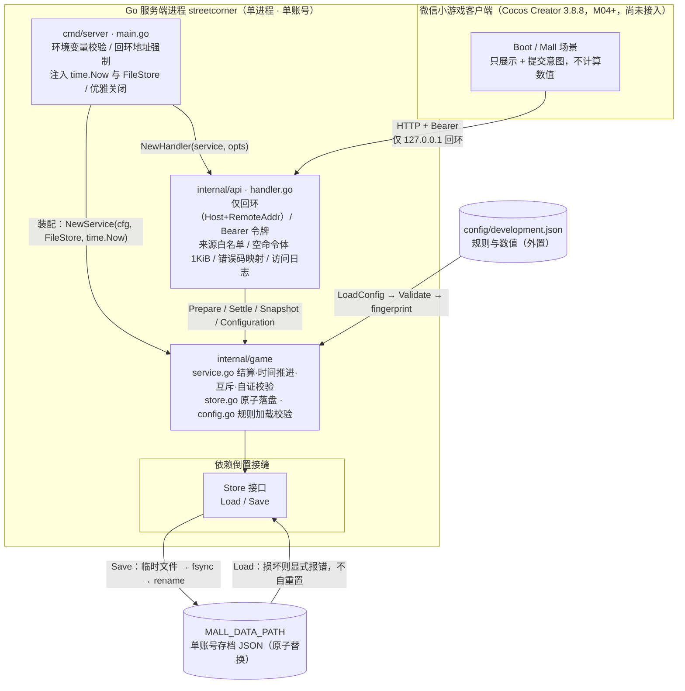

# 《街角百货铺》架构现状（M01 本地开发后端）

> 状态：现状实拍（以代码为准）· 最后更新：2026-09-14
> 适用范围：`cmd/server`、`internal/api`、`internal/game`、`config/development.json` 三包一配置
> 说明：本文只描述 M01 **实际实现** 的架构。关键取舍另见 `docs/architecture/adr/`。
> 基准事实来源：`cmd/server/main.go`、`internal/api/handler.go`、`internal/game/{service,store,config}.go` 及其测试。

---

## 0. ADR 索引

| 编号 | 标题 | 状态 |
| --- | --- | --- |
| [0001](adr/0001-服务端权威与客户端零计算.md) | 服务端权威与客户端零计算 | 已采纳（M01 已实现） |
| [0002](adr/0002-存档账目分段校验.md) | 存档账目分段校验 | 已决议，待实现（M01 为退化单段，M02 落地分段） |
| [0003](adr/0003-客流上限随经营规模动态增长.md) | 客流上限随经营规模动态增长 | 已决议，待实现（M01 固定值，M02 落地公式） |
| [0004](adr/0004-数值与规则全部外置到配置.md) | 数值与规则全部外置到配置 | 已采纳（M01 已实现，含配置变更拒绝旧存档） |

---

## 1. 分层与依赖方向

M01 是**三包单向依赖**的经典分层，依赖方向严格向下，无环：

```
cmd/server   ──►  internal/api   ──►  internal/game
（进程外壳）        （HTTP 边界）         （领域核心，叶子）
```

| 层 | 包 | 职责 | 依赖 |
| --- | --- | --- | --- |
| 外壳 | `cmd/server` | 进程启动、环境变量校验、回环地址强制、注入 `time.Now` 与 `FileStore`、HTTP 服务器调优、优雅关闭 | `internal/api`、`internal/game` |
| 边界 | `internal/api` | 仅回环访问、来源白名单、Bearer 令牌、空命令体校验、错误码映射、访问日志、响应头 | `internal/game` |
| 核心 | `internal/game` | 规则加载校验、结算与时间推进、并发串行化、存档自证、原子落盘 | **无内部依赖** |

**关键结构性事实：**

- **`internal/game` 是叶子，`cmd` 与 `api` 都依赖它，它不反向依赖任何内部包**。领域逻辑不感知 HTTP，也不感知文件系统。
- **依赖倒置的接缝是 `Store` 接口**（`internal/game/store.go`）：`Service` 只依赖 `Store` 抽象，`FileStore` 是它的文件实现，测试用内存实现替换。生产装配在 `cmd/server/main.go` 完成（`game.FileStore{Path: ...}`）。
- **时钟也是注入的**：`NewService(cfg, store, now)` 接收 `now func() time.Time`。生产注入 `time.Now`，测试注入可控时钟。这是"服务端权威时间"（ADR 0001）能在测试中被精确驱动的前提。
- **数值零硬编码**：`internal/game` 里没有游戏数值常量，全部来自 `Config`（ADR 0004）。

---

## 2. 并发模型

**设计口径：单进程、单账号、互斥锁串行化、先落盘再发布。**

- **单写者约束**：`Service` 的文档注释明确「恰好一个 Service 进程可以拥有一个存档文件」（`internal/game/service.go`）。多实例部署会破坏这一模型，属于 M07 要重做的事项。
- **一把互斥锁串行化所有访问**：`Service.mu sync.Mutex` 保护 `Snapshot`（读）与 `Prepare` / `Settle`（写）。所有状态变更走 `mutate`，而 `mutate` 全程持锁。
- **先落盘、再发布新状态（写前提交）**：`mutate` 的提交顺序是

  ```
  next := clone(s.state)          // 1. 在副本上计算
  accrue(&next, now, &result)     // 2. 结算 / 跨日刷新
  next.Revision++                 // 3. 递增修订号
  s.store.Save(next)              // 4. 先持久化
  s.state = next                  // 5. 成功后才发布到内存
  ```

  若 `Save` 失败，内存状态**原封不动**（回滚），客户端收到 `SAVE_FAILED`，本次操作整体未生效。这保证「内存状态」永远不会领先于「已落盘的存档」。
- **幂等来自状态判断，不靠去重表**：
  - 重复准备已开业店铺 → 直接返回 `changed=false`，**不写存档**（测试 `TestServicePrepareIsIdempotent`）。
  - 同一时刻重复结算 → `now.Equal(s.state.LastObservedAt)` 时返回 `changed=false`（测试 `TestServiceInitialState`、`TestServiceSettlementRetainsRemainder`）。
  - 并发 100 次准备同一店 → 只有 1 次 `changed=true`、只多写 1 次存档（测试 `TestServiceConcurrentPrepareAndSettle`）。
- **失败即不发布**：时钟回退、未知店铺、数值越界都在写之前返回错误，`Result{}` 空值，状态与存档零变化（测试 `TestServiceRejectsClockBackwards`、`TestServiceUnknownShopDoesNotMutate`、`TestServiceNumericLimitRollsBack`）。
- **热路径零共享可变状态外泄**：`clone` 深拷贝店铺切片，`Snapshot` / `Configuration` / `Result.State` 返回的都是副本，调用方改不动内部状态（测试 `TestServiceCopiesAreIsolated`）。

---

## 3. 存档语义

**设计口径：原子替换、加载即自证、损坏拒绝加载而非重置。**

- **原子替换落盘**：`FileStore.Save`（`internal/game/store.go`）走「临时文件 → fsync → rename」：

  ```
  os.MkdirAll(dir, 0700)
  os.CreateTemp(dir, ".mall-*.tmp")   // 同目录临时文件
  json.NewEncoder(file).Encode(state)
  file.Sync()                          // fsync，落盘
  file.Close()
  os.Rename(temp, Path)                // 原子替换
  // defer：失败路径关闭并删除临时文件
  ```

  同目录 rename 在 POSIX 上是原子的，因此**不会出现"半个存档"**；失败时 `defer` 清理临时文件，目录里只留一个正式存档（测试 `TestFileStoreRestart` 用 `assertTestDirectoryEntries` 断言目录只剩一个文件）。
- **加载即自证**：`NewService` 加载后调用 `validateState`，逐项重算：
  - schema 版本与规则指纹（ADR 0004）；
  - 计数范围（revision / coins / visitorsRemaining / nextShopIndex / 店铺数量）；
  - 时间戳一致性（两个时间非零、`LastAccrualAt ≤ LastObservedAt`、业务日期与两个时间戳的上海日期一致）；
  - **逐店账目**：`revenue == visitors × price`、`visitors` 非负、未准备店铺不得有累计（v1 规则，见 ADR 0002 的冲突标记）、以及防溢出的乘除边界；
  - **全局金币恒等式**：`coins == initialCoins + Σrevenue`。
- **损坏 / 不兼容 → 拒绝加载，绝不清零**：`FileStore.Load` 对缺失/损坏文件返回显式错误；`NewService` 校验不过就返回错误，**不写回默认状态**。测试 `TestFileStoreCorruptionIsNotOverwritten` 覆盖了空文件、截断、非法 JSON、未知字段、多值、类型错误、账目损坏、旧版本、规则不兼容等，并断言**原文件字节不变**。
- **首次创建只在"确无存档"时发生**：仅当 `Load` 返回 `os.ErrNotExist` 才初始化默认存档并写一次（测试 `TestServiceInitialState` 断言首次只保存一次）。
- **数值上限按 JS 安全整数设定**：`const maxSafeInteger = 1<<53 - 1`（`internal/game/service.go`）。所有累计量（coins / revenue / visitors / revision）都以此为上限，越界返回 `NUMERIC_LIMIT` 且不发布部分结果。选择 `2^53-1` 而非 `int64` 上限，是因为**客户端是 JS（微信小游戏）**，超过 `2^53` 的整数在 JS 里无法精确表示（呼应 ADR 0001 的客户端约束）。
- **业务日按 `Asia/Shanghai` 切分，不补历史**：`accrue` 在检测到业务日变化时刷新 `VisitorsRemaining`，把 `LastAccrualAt` 重置到当天 0 点，**不追补离线期间的客流与收益**（测试 `TestServiceShanghaiDayRefresh`、`TestServiceUTCMidnightDoesNotRefresh`）。

---

## 4. 安全边界

**设计口径：M01 只暴露给本机开发，纵深防御到请求级。**

| 措施 | 实现位置 | 说明 |
| --- | --- | --- |
| **绑定即回环** | `cmd/server/main.go` `run` | `MALL_LISTEN_ADDR` 必须是**显式回环 IP + 端口**（`net.ParseIP(host).IsLoopback()`）；填 `0.0.0.0` 或主机名 `localhost` 都拒绝启动 |
| **请求级回环双向校验** | `internal/api/handler.go` 中间件 | 同时校验 `Host` 头（`loopbackHost`）**和** `RemoteAddr`（`loopbackRemote`），任一不过 → `403 LOCAL_ONLY`。这是对「Host 头伪造 / 反向代理」的二道防线 |
| **来源白名单（无通配）** | `internal/api/handler.go` `NewHandler` | `AllowedOrigins` 空 = 不放开任何浏览器来源；显式拒绝 `""` / `*` / `null`；精确字符串匹配 |
| **CORS 精确回显** | `internal/api/handler.go` 中间件 | 仅当 `Origin` 命中白名单才回 `Access-Control-Allow-Origin: <该来源>`；**绝不通配** |
| **Bearer 令牌 + 常量时间比较** | `internal/api/handler.go` | 除 `/healthz` 外全部路由要求 `Authorization: Bearer <token>`；用 `subtle.ConstantTimeCompare` 防时序侧信道；`NewHandler` 要求令牌 ≥ 32 字符 |
| **空命令体 + 体积上限** | `internal/api/handler.go` `readEmptyCommand` | 只接受空 JSON 对象 `{}`；`http.MaxBytesReader(..., 1024)` 限制 1 KiB；仅接受 `application/json`（ADR 0001） |
| **安全响应头** | `internal/api/handler.go` 中间件 | `Content-Type: application/json; charset=utf-8`、`Cache-Control: no-store`、`X-Content-Type-Options: nosniff`、`Vary: Origin` |
| **HTTP 服务器调优** | `cmd/server/main.go` | `ReadHeaderTimeout 5s` / `ReadTimeout 10s` / `WriteTimeout 10s` / `IdleTimeout 30s` / `MaxHeaderBytes 8192`，缓解慢速连接与请求头攻击 |
| **错误不外泄内部细节** | `internal/api/handler.go` `respondOperation` | 内部错误统一映射为 `500 SAVE_FAILED`（细节只写服务端日志）；领域错误映射为稳定错误码 |

**稳定错误码集合**（客户端可依赖的契约）：
`INVALID_COMMAND`、`UNAUTHORIZED`、`LOCAL_ONLY`、`ORIGIN_DENIED`、`SHOP_NOT_FOUND`、`CLOCK_BACKWARDS`、`NUMERIC_LIMIT`、`BODY_TOO_LARGE`、`JSON_REQUIRED`、`SAVE_FAILED`。

> **上线红线（提示，不在 M01 范围内）：** 本地开发令牌与"仅本机访问"限制**必须在上线前彻底关掉**（草案 B5.5；《开发规划文档》M09 上线检查清单第一项）。

---

## 5. 可观测

**设计口径：结构化日志，且明确不记录敏感信息。**

- **结构化 JSON 日志**：进程级用 `slog.NewJSONHandler(os.Stderr, nil)` 输出到 stderr（`cmd/server/main.go`）。
- **访问日志字段**：`method`、`path`、`duration_ms`（`internal/api/handler.go` 中间件末尾）。
- **明确不记录**：令牌、请求体、查询参数、个人信息——代码里有显式注释「Never log Authorization, payloads, query parameters or personal identifiers」。测试 `TestRequestLogDoesNotLeakSecrets` 用查询串与自定义头注入"秘密"，断言日志不含它。
- **启动与健康自述**：启动日志与 `/healthz` 都带 `wechat_login: false` / `wechatLogin: false`，明确声明 M01 **不含微信登录**。
- **失败可定位**：操作失败在服务端 `logger.Error("operation failed", "path", ..., "error", err)` 记录完整错误，客户端只拿到笼统错误码（测试 `TestErrorMapping` 断言客户端响应不含内部错误细节，而服务端有记录）。

---

## 6. 模块依赖与数据流图



**请求处理链（`internal/api/handler.go` 的中间件顺序）：**

```
设置安全响应头
  → 回环校验（Host + RemoteAddr 双向）   ── 不通过 → 403 LOCAL_ONLY
  → 来源校验（Origin 在白名单内？）        ── 不通过 → 403 ORIGIN_DENIED
  → OPTIONS 预检 → 204 直接返回
  → Bearer 令牌校验（/healthz 除外）       ── 不通过 → 401 UNAUTHORIZED
  → 路由（mux）
      ├─ readEmptyCommand（{} / 1KiB / application/json）
      └─ service.Prepare / Settle / Snapshot
  → respondOperation（成功 → 200 Result；失败 → 稳定错误码）
  → 访问日志（method / path / duration_ms，不含敏感信息）
```

**发出一条写命令（`POST /api/v1/mall/settle`）时的数据流：**

```
客户端 ──{} ──► handler（回环→来源→令牌→空体）
      ──► Service.Settle ──► mu.Lock
                           ──► mutate: clone → accrue（服务端时钟计算）→ Revision++
                           ──► FileStore.Save: tmp → fsync → rename   ← 先落盘
                           ──► s.state = next                          ← 后发布
      ◄── Result{state, earnedCoins, visitorsUsed, changed} ── 客户端只做补间
```

---

## 7. 代码与草案差异清单

《玩法与技术方案（草案）》写了大量 v2 内容，**以下条目在 M01 代码中尚未实现**，按规划文档的模块归属归档。

### 7.1 规则与数值（模块 M02）

| 草案条目 | 出处 | 代码现状 | 规划模块 |
| --- | --- | --- | --- |
| 铺位解锁（价格、顺序、`unlockedSlots[]`） | A2 / B5.1 / B5.2 | **未实现**（`State` 无 `unlockedSlots`） | M02 |
| 店铺升级（1–5 级、等级单价表、`level`） | A3 / B5.1 / B5.2 | **未实现**（`ShopState` 无 `level`，单价固定） | M02 |
| 满铺加成（固定 +1） | A3 / B5.1 | **未实现** | M02 |
| 关店 | A2 / R-03 | **未实现**（只有 `Prepare`，无 close） | M02 |
| 动态客流上限（`基础 20 + 单店 × 15`，`dailyVisitorCap`） | A4 / B5.1 / B5.2 | **未实现**（M01 为固定 `dailyVisitors: 50`） | M02 |
| 账单分段（`segments[]`） | B5.2 | **未实现**（M01 为单一固定单价的退化校验） | M02 |
| 存档 schema v2（`unlockedSlots` / `dailyVisitorCap` / `spent` / `level` / `segments`） | B5.2 | **未实现**（`SchemaVersion` 恒为 1） | M02 |
| B5.3 校验规则调整 | B5.3 | **未实现**（含"未解锁"放宽规则，见下 7.2-C） | M02 |

### 7.2 代码与文档的**冲突/不一致**

> 这些不是"还没做"，而是**代码与文档互相矛盾**或**两份文档互相矛盾**，需要主理人拍板或排期修正。

| 编号 | 冲突 | 细节 | 建议 |
| --- | --- | --- | --- |
| **A** | **客流轮询顺序不一致** | **代码**：轮询按配置顺序 `clothing → dessert → bookstore → coffee → flowers`（衣橱→甜屋→书店→咖啡→花束，见 `config/development.json` 与 `TestServiceRoundRobin`）。**草案 A4**：写明顺序为 `咖啡 → 花束 → 衣橱 → 甜屋 → 书店`。两者顺序不同。 | 需与设计确认"客人先到一层还是二层"，M02 定稿前修正其中一方 |
| **B** | **客流上限：固定 vs 公式** | **代码**：固定 `dailyVisitors: 50`。**草案 A4**：`基础 20 + 单店 × 15`。（数值上 M01 的 50 恰等于 2 店时的公式值，差异在 3/4/5 店档位才显现。） | 由 [ADR 0003](adr/0003-客流上限随经营规模动态增长.md) 决议为公式，M02 落地 |
| **C** | **未开业店铺校验规则** | **代码** `validateState`：`(!shop.Prepared && shop.Visitors != 0)` → 拒绝"未准备店铺有累计客流"。**草案 B5.3**：放宽为"**未解锁铺位**不得有累计客流与收益"（因为关店要保留累计）。**当前若引入关店，会直接触发"关店即拒档"**。 | 由 [ADR 0002](adr/0002-存档账目分段校验.md) 决议为放宽，M02 落地 |
| **D** | **微信登录的模块归属互相矛盾** | **草案**：`POST /api/v1/session/wechat` 与 B5.5 标注 **M06**。**《开发规划文档》**：微信登录与云端存档为 **M07**。同一件事被编到两个模块。 | 以规划文档 M07 为准，修正草案标注 |
| **E** | **写操作日志口径** | **草案 B5.6**：结算、解锁、升级、关店四类写操作都要有可追踪日志（含结果码）。**代码**：只有通用访问日志（`method` / `path` / `duration_ms`），未按操作类型或结果码分类。 | M02 补结构化业务日志，或明确接受"以 path 追踪" |
| **F** | **店铺标识体系（shop vs slot）** | **代码**：以 shop ID（`clothing`/`dessert`/…）为核心，`floor`/`slot` 只是描述。**草案 B4.2**：解锁接口用 **slotId**（`f2-s1` 形式）。v2 需要引入独立的"铺位"维度并与现有 shop ID 建立映射。 | M02 设计时明确 shop↔slot 映射与命名，避免两套 ID 混用 |
| **G** | **"剩余客流" vs "上限"暴露** | **代码**：`GET /api/v1/mall` 返回 `VisitorsRemaining`（剩余），**不直接返回上限**；客户端要显示 HUD 分母需自行结合 `/api/v1/config`。**需求文档待确认项 2**：`36/50` 语义（已到店/上限？）本身尚未拍板。 | M02/M04 定稿 HUD 口径，决定是否在快照里直接暴露 `cap` 与 `visitorsServed` |
| **H** | **`fingerprint()` 的文档归属错误（非代码问题）** | 任务背景将 `fingerprint()` 记在 `internal/game/config.go`；**实际在 `internal/game/service.go`**。代码本身是一致的，仅文档描述需更正。 | 已在 [ADR 0004](adr/0004-数值与规则全部外置到配置.md) 注明 |

### 7.3 客户端与外围（M04–M09）

| 草案条目 | 出处 | 代码现状 | 规划模块 |
| --- | --- | --- | --- |
| Cocos 工程 / 主界面 / 场景与预制体 | B3 | **不存在**（无 `NewProject/` 内容落地） | M04 |
| 客户端每 5 秒轮询、切后台停止、回前台拉快照 | B3.6 | **不存在** | M05 |
| 客人走位 / 金币飘字 / 数字滚动 | B3.5 | **不存在** | M05 |
| 经营页 / 布局页 / 店铺详情 / 解锁升级确认弹窗 | B4.2 / 需求 6.2 | **不存在**（且设计图缺失，阻塞） | M06 |
| 微信登录 `code2session`、会话令牌替代开发令牌 | B5.5 | **不存在**（`wechat_login: false`） | M07（草案误标 M06） |
| 云端存档、并发与持久化方案重做 | B5.5 / B6 | **不存在**（M01 为单文件单进程） | M07 |
| 好友经营排行榜（开放数据域，无服务端接口） | B4.3 / A7 | **不存在** | M08 |
| 素材抠图管线（JPG 假透明 → 透明 PNG） | B3.4 | **不存在** | M03 |
| 上线前关闭本地开发令牌与"仅本机"限制 | B5.5 / B7 | **未做**（属上线检查清单） | M09 |

---

## 8. 已知边界（M01 自身声明，源自 `docs/M01-本地开发后端.md` 第七节）

1. `cmd/server` 没有单元测试，靠端到端联调覆盖；`run()` 内的环境变量与信号处理未做参数化（后续要单测需先拆依赖注入）。
2. 令牌认证只用于本机开发，接入微信时必须替换为真正的登录票据校验。
3. 存档为单文件、单进程设计，多实例部署需换成外部存储（会牵动并发与持久化方案）。
4. 尚未接入客户端，接口契约目前只由服务端测试保证。
5. 浏览器来源白名单为精确字符串匹配，未处理主机名大小写问题（浏览器实际发送小写主机名）。

---

## 9. 测试与验收基线

- 静态检查：`gofmt -l .` 无输出；`go vet ./...` 无告警。
- 测试：`go test -race ./...` 全绿。
- 覆盖率：`internal/game` **96.2%**、`internal/api` **94.8%**（`cmd/server` 由端到端联调覆盖）。
- 端到端联调：编译真实进程 + 真实端口 + 真实存档文件，17 项场景全部符合预期（清单见 `docs/M01-本地开发后端.md` 第五节）。
- 测试文件：
  - `internal/game/service_test.go`（结算时序、幂等、跨日、时钟回退、保存失败回滚、数值上限、并发、副本隔离、存档校验）
  - `internal/game/store_test.go`（原子替换、损坏拒绝、保存失败保留原文件、路径错误）
  - `internal/game/config_test.go`（开发配置、边界校验、严格 JSON、配置变更不复用旧档）
  - `internal/api/handler_test.go`（构造参数、本机限定、认证、来源策略、命令体、错误映射、路由、日志不泄露、并发只提交一次）

---

## 10. 客户端渲染约定（M04 前置 · SC-P1-004 结论）

> 本节是**架构层面**的输入约定，供 M04 客户端工程落地时遵循。**详细核对依据与来源见 `docs/architecture/平台事实核对.md`**（本文不重复罗列官方链接）。

**背景**：主界面需要 4 种店铺状态（未解锁 / 已解锁未开业 / 已开业 / 已关店），而现有素材只有"已开业"一种立绘。若按状态预烘 4 套 PNG，资产量与包体积都会膨胀。

**决策（已核实可行）**：**状态差异由"同一张贴图 + 运行时材质参数 + 叠加层"承担，不预烘 4 套 PNG。**

- 用**一份自定义 2D 材质**（effect 继承 Cocos `builtin-sprite`），暴露一个自发光 uniform。
- 运行时通过 **Sprite 的 `customMaterial`** 调 `setProperty('u_emissive', 0.30 / 0.45 / 1.00)` 切换三档（对应 S1/S4/S2·S3）。
- 纱罩 / 卷帘等**遮挡层用独立子节点 Sprite**（各自 SpriteFrame + 透明度），不用材质实现。
- 结果：状态切换 = 改一个 GPU uniform，**瞬间、无加载、无闪烁**。

**依据（Cocos Creator 3.8 官方文档）**：2D 渲染对象支持自定义材质（最多 1 个），修改属性通过 `spriteComp.customMaterial.setProperty(...)`；必须使用 `builtin-sprite`/`builtin-spine` 等 2D 专用 Shader。详见平台事实核对文档 §2.1。

**依赖与边界**：

- **M01 无客户端**，本节只是 M04 的输入约定；M04 落地后回填实际实现与真机复验结果。
- 自定义材质的**小游戏平台限制**：官方未设限（无已知阻断），但**必须在真机复验**（iOS 普通/高性能模式、Android 中低端机）。
- **降级路径**：若真机复验异常，退化为"预烘 PNG 变体（按状态换 SpriteFrame）"。代价是资产数上升、常驻内存升高、切换有潜在闪烁（须预加载全部变体）。**明确不如首选方案划算**。
- **归口**：渲染管线与 Shader（程基岩 / engineering-lead）、素材与叠加层（林绘澄 / art-director）。

**相关外部事实（美术预算口径，已核对）**：

- 微信小游戏**主包上限 4MB**（美术假设正确）、**主包+分包总和上限 30MB**（美术假设 20MB 偏保守）。
- 纹理压缩：**ASTC 6×6（含 alpha）/ 8×8（背景）可行**；**ETC2 仅作 Android 兜底**（iOS 不列 ETC2）；**WebP 未获官方确认，不采用**。
- 小游戏**不提供**"字号跟随系统"的自动适配（适老化指南面向小程序）；游戏内文本缩放须**自建**。
