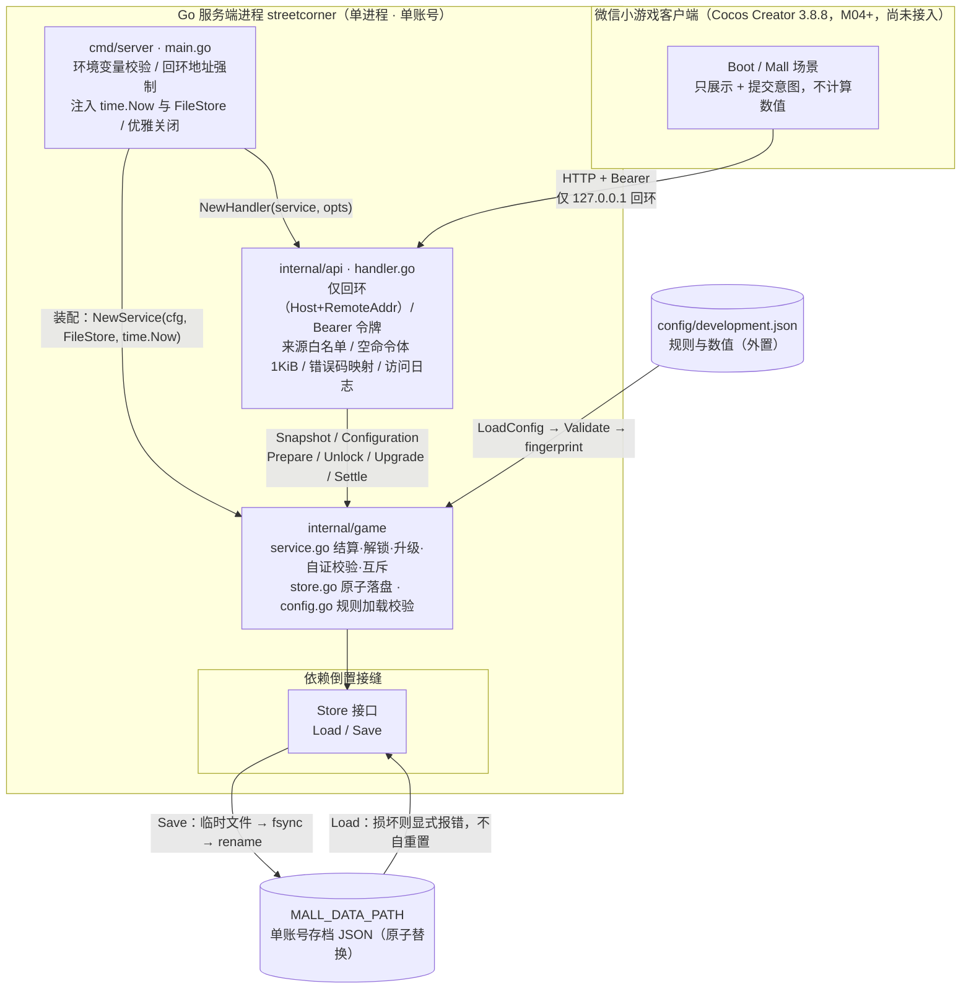

# 《街角百货铺》架构现状（M01 + M02 本地开发后端）

> 状态：现状实拍（以代码为准）· 最后更新：2026-09-18
> 适用范围：`cmd/server`、`internal/api`、`internal/game`、`config/development.json` 三包一配置
> 说明：本文只描述**实际实现**的架构（M01 服务端权威闭环 + M02 规则 v2 扩展）。关键取舍另见 `docs/architecture/adr/`。
> 基准事实来源：`cmd/server/main.go`、`internal/api/handler.go`、`internal/game/{service,store,config}.go` 及其测试。
> 模块级实现细节见 `docs/M01-本地开发后端.md` 与 `docs/M02-后端扩展.md`；本文不重复其验收表。

> **修订记录（v2 · 2026-09-18）**：本文原为 **M01 快照（2026-09-14）**，M02 实现随 `cc43ce7` 落地后未同步刷新，属文档债（由 SC-M02-QA-004 独立复核发现，登记为 `P2-E`）。本次按代码逐项回填：
>
> | 位置 | 原内容（已过期） | 现状 |
> | --- | --- | --- |
> | 标题 / §0 / §7.1 | M01 范围；解锁、升级、满铺、动态客流、分段、schema v2 标「未实现」 | 六项均已实现，逐项给出落点；ADR 0002 / 0003 转「已实现」 |
> | §2 锁覆盖 | 只列 `Prepare` / `Settle` | 补 `Unlock` / `Upgrade`，并写入 M02 回修后的提交与空转语义 |
> | §3 自证清单 | 逐店单段校验、`coins == initialCoins + Σrevenue`、金币下界为初始值 | 按 `validateState` 实际分支重写：分段恒等式、金币恒等式含 `− spent`、下界 `coins >= 0`、`unlockedSlots` 结构校验、客流上限二态校验 |
> | §3 业务日 | 「刷新 `VisitorsRemaining`」 | 现不刷新（跨日重置为未冻结 + 占位 `0`），刷新发生在首次实际产出客人的那笔结算 |
> | §4 错误码 | 10 个 | 16 个（补 `SLOT_LOCKED`/`SLOT_ORDER`/`SHOP_NOT_OPEN`/`MAX_LEVEL`/`INSUFFICIENT_COINS`） |
> | §6 路由 | 5 条 | 7 条（补 `POST /api/v1/slots/{slotId}/unlock`、`POST /api/v1/shops/{id}/upgrade`） |
> | §7.2 冲突 | A 待改序、B 待落地、E/G/F 未定 | A/B/F/G 已解决；新增 I（游标口径）、J（分段上界未落校验）；E 仍未处理 |
> | §8 已知边界 | 5 条（M01 口径） | 补 M02 新增边界（调数值即毁旧档、跨进程无互斥、锁内同步落盘、视图暴露派生字段） |
> | §9 基线 | 覆盖率 96.2% / 94.8% | 97.3% / 99.1%，测试函数 71 个，新增 M02 端到端联调与探针取证 |

---

## 0. ADR 索引

| 编号 | 标题 | 状态 |
| --- | --- | --- |
| [0001](adr/0001-服务端权威与客户端零计算.md) | 服务端权威与客户端零计算 | 已采纳（M01 实现，M02 沿用：所有命令仍只接受空体 `{}`） |
| [0002](adr/0002-存档账目分段校验.md) | 存档账目分段校验 | **已实现**（M02：`Segment{unitPrice,visitors,revenue}` + 逐段恒等式；退化单段已被真分段取代） |
| [0003](adr/0003-客流上限随经营规模动态增长.md) | 客流上限随经营规模动态增长 | **已实现**（M02：`base + per × 冻结瞬间开业店数`，配 `capFrozen` 二态；固定 `dailyVisitors` 已删） |
| [0004](adr/0004-数值与规则全部外置到配置.md) | 数值与规则全部外置到配置 | 已采纳（M01 实现，M02 扩展 v2 规则字段：`slots[].unlockCost/unlockOrder`、`shops[].levelCoinsPerVisitor`、`upgradeCosts`） |

---

## 1. 分层与依赖方向

服务端仍是**三包单向依赖**的经典分层，依赖方向严格向下，无环。M02 只往 `internal/game` 与 `internal/api` 里加内容，**没有引入新包、新层或新的跨层依赖**：

```
cmd/server   ──►  internal/api   ──►  internal/game
（进程外壳）        （HTTP 边界）         （领域核心，叶子）
```

| 层 | 包 | 职责 | 依赖 |
| --- | --- | --- | --- |
| 外壳 | `cmd/server` | 进程启动、环境变量校验、回环地址强制、注入 `time.Now` 与 `FileStore`、HTTP 服务器调优、优雅关闭 | `internal/api`、`internal/game` |
| 边界 | `internal/api` | 仅回环访问、来源白名单、Bearer 令牌、空命令体校验、错误码映射、访问日志、响应头；M02 增两条写命令路由与**双 ID 命名空间**（`{slotId}` 与 `{id}`） | `internal/game` |
| 核心 | `internal/game` | 规则加载校验、结算与时间推进、**铺位解锁 / 店铺升级两条命令**、并发串行化、存档自证、原子落盘 | **无内部依赖** |

**关键结构性事实：**

- **`internal/game` 是叶子，`cmd` 与 `api` 都依赖它，它不反向依赖任何内部包**。领域逻辑不感知 HTTP，也不感知文件系统。
- **依赖倒置的接缝是 `Store` 接口**（`internal/game/store.go`）：`Service` 只依赖 `Store` 抽象，`FileStore` 是它的文件实现，测试用内存实现替换。生产装配在 `cmd/server/main.go` 完成（`game.FileStore{Path: ...}`）。M02 未改这个接口的形状——`State` 内部结构变了，`Load/Save` 签名不变。
- **时钟也是注入的**：`NewService(cfg, store, now)` 接收 `now func() time.Time`。生产注入 `time.Now`，测试注入可控时钟。这是"服务端权威时间"（ADR 0001）能在测试中被精确驱动的前提。
- **数值零硬编码**：`internal/game` 里没有游戏数值常量，全部来自 `Config`（ADR 0004）。M02 的解锁价格、等级单价、升级花费、满铺加成、客流档位同样只在 `config/development.json`。
- **派生量不落盘**：`unitPrice`、`upgradeCost`、`visitorsServed`、`nextSlotId`、`nextUnlockCost` 全部由 `Service.view()` 在读取时从「规则 + 已存状态」现算，存档里不存它们。因此改配置不会留下陈旧的派生值。

---

## 2. 并发模型

**设计口径：单进程、单账号、互斥锁串行化、先落盘再发布。**

- **单写者约束**：`Service` 的文档注释明确「恰好一个 Service 进程可以拥有一个存档文件」（`internal/game/service.go`）。多实例部署会破坏这一模型，属于 M07 要重做的事项。
- **一把互斥锁串行化所有访问**：`Service.mu sync.Mutex` 保护 `Snapshot`（读）与 `Prepare` / `Unlock` / `Upgrade` / `Settle`（写）。四条写命令**共用同一把锁、同一条 `mutate` 提交通道**（M02 未给解锁与升级另设锁，这是验收 #9d 要求的「与 prepare 共用同一套互斥锁与先落盘再发布语义」）。`mutate` 全程持锁。
- **先落盘、再发布新状态（写前提交）**：`mutate` 的提交顺序是

  ```
  next := clone(s.state)          // 1. 在副本上计算
  accrue(&next, now, &result)     // 2. 结算 / 跨日刷新
  apply(next, now)                // 3. 命令自身的变更（开店 / 解锁 / 升级；纯结算时为空）
  无实质变化 → 直接返回 changed=false，不提交     // 3b. 仅纯结算且除观察游标外无字段变化
  next.Revision++                 // 4. 递增修订号
  s.store.Save(next)              // 5. 先持久化
  s.state = next                  // 6. 成功后才发布到内存
  ```

  若 `Save` 失败，内存状态**原封不动**（回滚），客户端收到 `SAVE_FAILED`，本次操作整体未生效。这保证「内存状态」永远不会领先于「已落盘的存档」。
- **幂等来自状态判断，不靠去重表**：
  - 重复准备已开业店铺 → 直接返回 `changed=false`，**不写存档**（测试 `TestServicePrepareIsIdempotent`）。
  - **重复解锁已拥有铺位 → 幂等成功**（`changed=false`、不重复扣费、不写存档，测试 `TestUnlockIsIdempotent`）。这是 2026-09-14 的拍板：不引入 `ALREADY_UNLOCKED` 错误码。
  - **任何没有实质变化的纯结算都是无操作**：零开业、间隔未满、当日客流已耗尽三种空转下，`accrue` 不移动结算游标，`mutate` 以 `sameCommittedState`（忽略 `lastObservedAt` 的深比较）判定「与已发布状态相同」，于是 `changed=false`、不递增 `revision`、不落盘（GDD §5.7.2；测试 `TestSettleDoesNotCommitWithoutChange`）。**2026-09-18 前**的实现是「只要 `now` 不等于上次观察时刻就提交」，导致 5 秒轮询在空闲期也每 5 秒写一次盘——该偏离由 SC-M02-QA-004 发现并回修（`docs/M02-验收口径评审.md` §8.5）。
  - 由此，响应中的 `lastObservedAt` 语义是**最后一次发布状态的时刻**，不是最后一次被轮询的时刻；客户端（M04/M05）不得用它判断「服务端是否活着」，应以 HTTP 状态码为准。
  - 并发 100 次准备同一店 → 只有 1 次 `changed=true`、只多写 1 次存档（测试 `TestServiceConcurrentPrepareAndSettle`）。
- **消费类命令先判后改，拒绝即零副作用**：`Unlock` 先查 `ErrSlotOrder` 再查 `ErrInsufficientCoins`，`Upgrade` 先查 `ErrSlotLocked` 再查 `ErrShopNotOpen` 再查 `ErrMaxLevel` 再查金币——**全部在 `mutate` 之前返回**，故被拒命令不写盘、不动状态（探针取证见 `docs/M02-验收口径评审.md` §8.2 #1/#2/#8）。判序本身是契约：未解锁的店铺升级返回 `SLOT_LOCKED` 而非 `SHOP_NOT_OPEN`，因为「先去解锁」比「先开业」更贴近玩家能做的修正。
- **失败即不发布**：时钟回退、未知店铺/铺位、数值越界都在写之前返回错误，`Result{}` 空值，状态与存档零变化（测试 `TestServiceRejectsClockBackwards`、`TestServiceUnknownShopDoesNotMutate`、`TestServiceNumericLimitRollsBack`）。
- **热路径零共享可变状态外泄**：`clone` 深拷贝店铺与分段切片，`Snapshot` / `Configuration` / `Result.State` 返回的都是副本，调用方改不动内部状态（测试 `TestServiceCopiesAreIsolated`）。`NewService` 也对注入的 `Config` 做逐层深拷贝，防止 `validateSlots` 之外的路径改规则。
- ⚠️ **锁不跨进程**：`sync.Mutex` 只保护本进程。两个 `cmd/server` 实例指向同一 `MALL_DATA_PATH` 会互相覆盖（`os.Rename` 层面不报错）。M07 前靠「仅回环 + 单实例」约定兜住。

---

## 3. 存档语义

**设计口径：原子替换、加载即自证、损坏拒绝加载而非重置。**

### 3.1 落盘原子性

`FileStore.Save`（`internal/game/store.go`）走「临时文件 → fsync → rename」：

```
os.MkdirAll(dir, 0700)
os.CreateTemp(dir, ".mall-*.tmp")   // 同目录临时文件
json.NewEncoder(file).Encode(state)
file.Sync()                          // fsync，落盘
file.Close()
os.Rename(temp, Path)                // 原子替换
// defer：失败路径关闭并删除临时文件
```

同目录 rename 在 POSIX 上是原子的（Windows 上 `os.Rename` 走 `MOVEFILE_REPLACE_EXISTING`，实测可覆盖），因此**不会出现"半个存档"**；失败时 `defer` 清理临时文件，目录里只留一个正式存档（测试 `TestFileStoreRestart` 用 `assertTestDirectoryEntries` 断言目录只剩一个文件）。

### 3.2 存档形态（schema v2）

`State`（`internal/game/service.go`）落盘字段：

| 字段 | 语义 | 归属 |
| --- | --- | --- |
| `schemaVersion` | 恒为 `2`；不等于 2 即判不兼容、拒档 | 版本位 |
| `rulesFingerprint` | `sha256(json.Marshal(Config))`，规则一改即变（ADR 0004） | 版本位 |
| `revision` | 每次**提交** +1（空转结算不 +1） | 游标 |
| `coins` / `spent` | 余额与累计支出；不变量见 §3.3 | 账目 |
| `businessDay` | `Asia/Shanghai` 的 `YYYY-MM-DD` | 时间 |
| `capFrozen` / `dailyVisitorCap` | **二态配对**：未冻结时 `capFrozen=false` 且 `dailyVisitorCap` 落盘占位 `0`（读取方必须忽略）；已冻结时值为 `base + per × 冻结瞬间开业店数` | 客流 |
| `visitorsRemaining` | 当日剩余可服务客流；未冻结时恒 `0` | 客流 |
| `lastAccrualAt` / `lastObservedAt` | 结算游标 / 最后一次发布状态的时刻 | 时间 |
| `nextShopIndex` | 轮询游标（见 §3.4 的口径提醒） | 客流 |
| `unlockedSlots[]` | 已购铺位 ID 数组，**按 `unlockOrder` 规范化排序**；结构约束见 §3.3 | 铺位 |
| `shops[]` | 逐店：`id` / `prepared` / `level` / `visitors` / `revenue` / `segments[]` | 账目 |
| `segments[]` | 逐段：`unitPrice` / `visitors` / `revenue`（**不含**生效时间——段边界与日界的映射无法从存档判定，这是 ADR 0002 的已知取舍） | 账目 |

### 3.3 加载即自证

`NewService` 加载后调用 `validateState`，逐项重算，任一不过即**拒绝加载**：

- **版本与规则**：`schemaVersion == 2` 且 `rulesFingerprint == fingerprint(cfg)`。
- **计数范围**：`revision ∈ [1, 2^53−1]`、**`coins >= 0`**（M02 关键放宽，见下）、`coins/spent <= 2^53−1`、`nextShopIndex ∈ [0, 店数)`、店铺数量与配置一致。
  > **金币下界的历史变更**：M01 写的是 `coins >= initialCoins`。v2 引入消费后该不变量会**误杀合法存档**（玩家一解锁铺位，金币即低于初始值 → 被判损坏）。M02 放宽为 `coins >= 0`（验收 #10；测试 `TestSaveSelfProvesAfterSpending`）。
- **时间戳一致性**：两个时间非零、`lastAccrualAt <= lastObservedAt`、`businessDay` 与**两个**时间戳各自的上海日期都一致。
- **`unlockedSlots` 结构**（`validateUnlockedSlots`，对应 GDD §3.7/§5.5）：元素必须都是配置里的已知 `slotId`；无重复；数量落在 `[开局铺位数, 铺位总数]`（当前配置即 `[2,5]`）；必须包含全部开局铺位；且**向下闭合**——数组里每个铺位的所有更低 `unlockOrder` 铺位也都已解锁（等价于"构成 `unlockOrder` 前缀，无跳序"）。违反任一项即判损坏。
- **客流上限二态**（`validateVisitorCap`，对应 GDD §5.7.3）：`capFrozen=false` ⇒ `dailyVisitorCap == 0` **且** `visitorsRemaining == 0`；`capFrozen=true` ⇒ 值落在合法档位集合 `{base + per × k | k ∈ [1, 店数]}`（用上下界 + 整除性判定，**不用 `0` 作哨兵**），且 `visitorsRemaining ∈ [0, 上限]`，且**至少一家店已开业**。
- **逐店账目**：`id` 与配置同序；`level ∈ [1, maxLevel]`；**未解锁铺位不得已开业**；未开业 ⇒ `visitors`/`revenue`/`segments` 全为空零；已开业 ⇒ 至少一段；**每段** `revenue == visitors × unitPrice` 且 `unitPrice >= 1`（空段 `0 == 0 × price` 自然成立）；逐段求和后与店铺聚合值相等。
- **全局金币恒等式**：`coins == initialCoins + Σrevenue − spent`（且 `spent <= initialCoins + Σrevenue`）。

> 自证的设计意图：账目本身是唯一的真相来源。任何手改存档想凭空造币，都必须同时凑齐逐段恒等式、聚合一致与全局恒等式三关——而这三关都是**整等式**，不是范围检查。

### 3.4 其余存档事实

- **损坏 / 不兼容 → 拒绝加载，绝不清零**：`FileStore.Load` 对缺失/损坏文件返回显式错误；`NewService` 校验不过就返回错误，**不写回默认状态**。测试 `TestFileStoreCorruptionIsNotOverwritten` 覆盖了空文件、截断、非法 JSON、未知字段、多值、类型错误、账目损坏、旧版本、规则不兼容等，并断言**原文件字节不变**。M02 的非法存档用例扩到 `unlockedSlots` 五类与 `capFrozen` 二态。
- **首次创建只在"确无存档"时发生**：仅当 `Load` 返回 `os.ErrNotExist` 才初始化默认存档并写一次；初始铺位取 `unlockOrder == 0` 的铺位（当前配置 = 一层两个），`unlockedSlots` 在内存里按 `unlockOrder` 规范化（测试 `TestServiceInitialState`）。
- **`unlockedSlots` 元素顺序无含义**：落盘前经 `canonicalSlots` 排序，加载时也在内存里再规范化一次但**不改写文件**（避免仅为整理顺序而写盘）。
- **数值上限按 JS 安全整数设定**：`const maxSafeInteger = 1<<53 - 1`（`internal/game/service.go`）。所有累计量（`coins` / `spent` / `revenue` / `visitors` / 每段的 `visitors` 与 `revenue` / `revision`）都以此为上限，越界返回 `NUMERIC_LIMIT` 且不发布部分结果。选择 `2^53-1` 而非 `int64` 上限，是因为**客户端是 JS（微信小游戏）**，超过 `2^53` 的整数在 JS 里无法精确表示（呼应 ADR 0001 的客户端约束）。
  > M02 的两处消费路径**不另设溢出守卫**，依据是恒等式本身：`coins >= cost` 且 `coins == initial + Σrevenue − spent` ⇒ `spent + cost <= initial + Σrevenue <= maxSafeInteger`（见 `Unlock` / `Upgrade` 的注释；测试 `TestSpentCannotOverflow`）。
- **业务日按 `Asia/Shanghai` 切分，不补历史**：`accrue` 检测到业务日变化时刷新 `businessDay`、把 `capFrozen` 置回 `false`、`dailyVisitorCap` 与 `visitorsRemaining` 归 `0` 占位、`lastAccrualAt` 重置到当天 0 点，**不追补离线期间的客流与收益**（测试 `TestServiceShanghaiDayRefresh`、`TestServiceUTCMidnightDoesNotRefresh`）。
  > ⚠️ 与 M01 的差异：**跨日不再刷新可服务客流**。当日上限改由「首次实际产出客人的那笔结算」冻结（ADR 0003 + GDD §5.7.2），因此 `accrue` 在客流耗尽（`capFrozen && visitorsRemaining == 0`）时是纯无操作，不移动游标。
- **轮询游标的口径提醒**：`nextShopIndex` 的推进是 `(index+1) % 店数`，**落在未开业店铺上是正常态**（跳过动作发生在下一次 `accrue` 的循环里）。GDD §5.5 曾把"游标指向已开业店铺"列为校验规则，按字面实现会误拒合法存档——该规格措辞待修正，见 §7.2 冲突 **I**。

---

## 4. 安全边界

**设计口径：只暴露给本机开发，纵深防御到请求级。** M02 未扩张信任面——新增的两条写命令走的是同一套中间件与同一种空命令体约定。

| 措施 | 实现位置 | 说明 |
| --- | --- | --- |
| **绑定即回环** | `cmd/server/main.go` `run` | `MALL_LISTEN_ADDR` 必须是**显式回环 IP + 端口**（`net.ParseIP(host).IsLoopback()`）；填 `0.0.0.0` 或主机名 `localhost` 都拒绝启动 |
| **请求级回环双向校验** | `internal/api/handler.go` 中间件 | 同时校验 `Host` 头（`loopbackHost`）**和** `RemoteAddr`（`loopbackRemote`），任一不过 → `403 LOCAL_ONLY`。这是对「Host 头伪造 / 反向代理」的二道防线 |
| **来源白名单（无通配）** | `internal/api/handler.go` `NewHandler` | `AllowedOrigins` 空 = 不放开任何浏览器来源；显式拒绝 `""` / `*` / `null`；精确字符串匹配 |
| **CORS 精确回显** | `internal/api/handler.go` 中间件 | 仅当 `Origin` 命中白名单才回 `Access-Control-Allow-Origin: <该来源>`；**绝不通配** |
| **Bearer 令牌 + 常量时间比较** | `internal/api/handler.go` | 除 `/healthz` 外全部路由要求 `Authorization: Bearer <token>`；用 `subtle.ConstantTimeCompare` 防时序侧信道；`NewHandler` 要求令牌 ≥ 32 字符 |
| **空命令体 + 体积上限** | `internal/api/handler.go` `readEmptyCommand` | 只接受空 JSON 对象 `{}`（四个写命令一律如此，包括解锁与升级）；`http.MaxBytesReader(..., 1024)` 限制 1 KiB；仅接受 `application/json`（ADR 0001） |
| **双 ID 命名空间** | `internal/api/handler.go` 路由 | 铺位命令用 `{slotId}`、店铺命令用 `{id}`；**传错不报"参数错误"而是 404 `SHOP_NOT_FOUND`**（两套 ID 都走同一个「目标不存在」码，是有意的统一处理） |
| **安全响应头** | `internal/api/handler.go` 中间件 | `Content-Type: application/json; charset=utf-8`、`Cache-Control: no-store`、`X-Content-Type-Options: nosniff`、`Vary: Origin` |
| **HTTP 服务器调优** | `cmd/server/main.go` | `ReadHeaderTimeout 5s` / `ReadTimeout 10s` / `WriteTimeout 10s` / `IdleTimeout 30s` / `MaxHeaderBytes 8192`，缓解慢速连接与请求头攻击 |
| **错误不外泄内部细节** | `internal/api/handler.go` `respondOperation` | 内部错误统一映射为 `500 SAVE_FAILED`（细节只写服务端日志）；领域错误映射为稳定错误码 |
| **规则版本可观测** | `GET /healthz` | 返回 `mode: local-development` 与 `wechatLogin: false`，声明不含微信登录 |

**稳定错误码集合（15 个，客户端可依赖的契约）**：
`INVALID_COMMAND`、`JSON_REQUIRED`、`BODY_TOO_LARGE`、`UNAUTHORIZED`、`LOCAL_ONLY`、`ORIGIN_DENIED`、`SHOP_NOT_FOUND`、`SLOT_LOCKED`、`SLOT_ORDER`、`SHOP_NOT_OPEN`、`MAX_LEVEL`、`INSUFFICIENT_COINS`、`CLOCK_BACKWARDS`、`NUMERIC_LIMIT`、`SAVE_FAILED`。
其中 6 个由 `readEmptyCommand` 与中间件产生（前 6 项），9 个由 `respondOperation` 产生——8 个来自 9 个领域错误（`ErrUnknownShop` 与 `ErrUnknownSlot` 共用 `SHOP_NOT_FOUND`），外加兜底 `SAVE_FAILED`。

> **上线红线（提示，不在本模块范围内）：** 本地开发令牌与"仅本机访问"限制**必须在上线前彻底关掉**（草案 B5.5；《开发规划文档》M09 上线检查清单第一项）。

---

## 5. 可观测

**设计口径：结构化日志，且明确不记录敏感信息。**

- **结构化 JSON 日志**：进程级用 `slog.NewJSONHandler(os.Stderr, nil)` 输出到 stderr（`cmd/server/main.go`）。
- **访问日志字段**：`method`、`path`、`duration_ms`（`internal/api/handler.go` 中间件末尾）。四条写命令因此天然可区分（path 不同），但**没有按操作类型/结果码分类的业务日志**——见 §7.2 冲突 **E**，M02 未补。
- **明确不记录**：令牌、请求体、查询参数、个人信息——代码里有显式注释「Never log Authorization, payloads, query parameters or personal identifiers」。测试 `TestRequestLogDoesNotLeakSecrets` 用查询串与自定义头注入"秘密"，断言日志不含它。
- **失败可定位**：操作失败在服务端 `logger.Error("operation failed", "path", ..., "error", err)` 记录完整错误，客户端只拿到笼统错误码（测试 `TestErrorMapping` 断言客户端响应不含内部错误细节，而服务端有记录）。
- **启动自述**：启动日志带 `address`、`rules_version`、`wechat_login: false`。

---

## 6. 模块依赖与数据流图



**路由表（7 条，`internal/api/handler.go`）：**

| 方法 | 路径 | 落到 | 命令体 |
| --- | --- | --- | --- |
| `GET` | `/healthz` | 进程自述（**免令牌**） | — |
| `GET` | `/api/v1/config` | `Service.Configuration()` | — |
| `GET` | `/api/v1/mall` | `Service.Snapshot()`（不结算、不刷新） | — |
| `POST` | `/api/v1/shops/{id}/prepare` | `Service.Prepare(shopId)` | `{}` |
| `POST` | `/api/v1/slots/{slotId}/unlock` | `Service.Unlock(slotId)` | `{}` |
| `POST` | `/api/v1/shops/{id}/upgrade` | `Service.Upgrade(shopId)` | `{}` |
| `POST` | `/api/v1/mall/settle` | `Service.Settle()` | `{}` |

**请求处理链（`internal/api/handler.go` 的中间件顺序）：**

```
设置安全响应头
  → 回环校验（Host + RemoteAddr 双向）   ── 不通过 → 403 LOCAL_ONLY
  → 来源校验（Origin 在白名单内？）        ── 不通过 → 403 ORIGIN_DENIED
  → OPTIONS 预检 → 204 直接返回
  → Bearer 令牌校验（/healthz 除外）       ── 不通过 → 401 UNAUTHORIZED
  → 路由（mux）
      ├─ readEmptyCommand（{} / 1KiB / application/json）
      └─ service.Prepare / Unlock / Upgrade / Settle / Snapshot / Configuration
  → respondOperation（成功 → 200 Result；失败 → 稳定错误码）
  → 访问日志（method / path / duration_ms，不含敏感信息）
```

**发出一条写命令时的数据流（四条写命令同构，以解锁为例）：**

```
客户端 ──{} ──► handler（回环→来源→令牌→空体）
      ──► Service.Unlock(slotID) ──► mu.Lock
                           ──► 门禁：未知铺位 / 已拥有 / 跳序 / 金币不足  ← 拒绝即零副作用、不写盘
                           ──► mutate: clone → accrue（服务端时钟计算）
                                        → apply（扣费、spent 累加、铺位入表并规范化排序）
                                        → Revision++ → FileStore.Save（tmp → fsync → rename）← 先落盘
                                        → s.state = next                                       ← 后发布
      ◄── Result{state, earnedCoins, visitorsUsed, changed} ── 客户端只做补间
```

---

## 7. 代码与文档差异清单

原 §7.1 的「M02 尚未实现」清单已整体失效，改记为「v2 规则 ↔ 代码落点」；未实现项集中在 §7.3（客户端与外围）。

### 7.1 规则与数值（模块 M02 已落地）

| 规则 | 出处 | 代码落点 | 状态 |
| --- | --- | --- | --- |
| 铺位解锁（价格、顺序、已解锁集合） | A2 / B5.1 / B5.2 | `Service.Unlock` + `State.UnlockedSlots` + `lowerOrdersUnlocked`；配置 `slots[].unlockCost/unlockOrder/shopId` | ✅ 已实现 |
| 店铺升级（等级、等级单价、花费） | A3 / B5.1 / B5.2 | `Service.Upgrade` + `ShopState.Level` + 配置 `shops[].levelCoinsPerVisitor` / `upgradeCosts` | ✅ 已实现 |
| 满铺加成 | A3 / B5.1 | `Service.floorFull`（**同层全部「已解锁且已开业」**才 `+ fullFloorBonus`）+ `unitPrice` | ✅ 已实现 |
| 动态客流上限 | A4 / B5.1 / B5.2 | `accrue` 内 `base + per × 冻结瞬间开业店数`，配 `capFrozen` 二态；固定 `dailyVisitors` 已从配置删除 | ✅ 已实现 |
| 账单分段 | B5.2 | `Segment` + `syncSegments` / `syncFloorSegments`；触发点为「开店建首段」「升级改价」「本层满铺状态变化」三处 | ✅ 已实现 |
| 存档 schema v2 | B5.2 | `schemaVersion = 2`，新增 `unlockedSlots` / `spent` / `level` / `segments` / `capFrozen` / `dailyVisitorCap` | ✅ 已实现 |
| B5.3 校验规则 | B5.3 | 未放宽的那条（未开业不得有累计）保持；**金币下界由 `>= initialCoins` 改为 `>= 0`**、恒等式加 `− spent`、逐段取代单段 | ✅ 已实现（含一处必要放宽，见 §3.3） |
| 开店建段硬顺序 | GDD §4.3 | `Prepare` 的提交闭包：置 `prepared` →（必要时锚游标）→ `syncFloorSegments` → 建/追加段。触发满铺的那家新店只产出**一条 bonus 价段**，无 pre-bonus 空段 | ✅ 已实现（e2e 存档实证，评审 §8.2 #4） |

### 7.2 代码与文档的**冲突/不一致**

> 这些不是"还没做"，而是**代码与文档互相矛盾**或**两份文档互相矛盾**，需要主理人拍板或排期修正。
> **状态图例**：**仍成立**（待后续处理）／**已决议**（方向已定、待实现）／**已解决**（差异已消失，仅留历史记录）。本表最易积"僵尸条目"，**变更发生后请回表核对**。

| 编号 | 冲突 | 细节 | 状态与建议 |
| --- | --- | --- | --- |
| **A** | ~~客流轮询顺序不一致~~ | 原：代码按 `clothing → dessert → bookstore → coffee → flowers`，草案 A4 要求 `咖啡 → 花束 → 衣橱 → 甜屋 → 书店`。 | **已解决（M02）**：`config/development.json` 的 `shops` 已按「一层临街优先」排为 `coffee → flowers → clothing → dessert → bookstore`，与草案一致。规则指纹随之改变，旧档被拒（预期） |
| **B** | ~~客流上限：固定 vs 公式~~ | 原：代码固定 `dailyVisitors: 50`，草案要求 `基础 20 + 单店 × 15`。 | **已解决（M02）**：公式已落地（§7.1 第四行），固定字段删除 |
| **C** | **未开业店铺校验规则** | ~~关店会触发"关店即拒档"~~ 关店功能移除后 `prepared` 单调递增，「未解锁 ⇒ 未开业」，M01 那条例程即最终形态。 | **无需修正**：ADR 0002 的「随附决策（放宽）」已作废，代码与文档一致 |
| **D** | **微信登录的模块归属互相矛盾** | ~~草案标 M06~~ 与规划文档标 M07 冲突。 | **已解决（2026-09-14）**：草案已改标 M07。本行保留作历史 |
| **E** | **写操作日志口径** | 草案 B5.6：**结算、解锁、升级**三类写操作都要有可追踪日志（含结果码）。代码只有通用访问日志（`method`/`path`/`duration_ms`），未按操作类型或结果码分类。 | **仍成立（M02 未处理）**。四条写命令的 path 已可区分，缺的是「结果码 + 是否提交」这一维。建议 M04 需要排查联动时一并补，或明确接受"以 path 追踪" |
| **F** | ~~店铺标识体系（shop vs slot）~~ | 原：代码只有 shop 维度，草案 B4.2 要求解锁用 `slotId`。 | **已解决（M02）**：两套 ID 已分离并落到路由（§4「双 ID 命名空间」），经 `slots[].shopId` 一对一映射；配置侧新增双向校验——铺位必须指向已有店铺位置，且**两个铺位不得共用同一 `(floor, position)`**（SC-M02-QA-004 `P1-B` 回修） |
| **G** | ~~"剩余客流" vs "上限"暴露~~ | 原：快照只给 `visitorsRemaining`，客户端要自己结合 `/api/v1/config` 算分母。 | **已解决（M02）**：快照同时暴露 `capFrozen`、`dailyVisitorCap`（未冻结时为 JSON `null`）、`visitorsServed`、`visitorsRemaining`；另给 `nextSlotId`/`nextUnlockCost`/逐店 `unitPrice`/`upgradeCost`，HUD 不需要自己推算 |
| **H** | **`fingerprint()` 的文档归属错误（非代码问题）** | 早期任务背景把它记在 `config.go`，实际在 `service.go`。 | 已在 ADR 0004 注明，代码一致 |
| **I** | **GDD §5.5「轮询游标指向已开业店铺」与实现口径冲突**（新增，`P2-A`） | 实现把游标推进到 `(index+1) % 店数`，**落在未开业店上是常态**，跳过发生在下次 `accrue`；`validateState` 只校验索引在界内。若照 §5.5 字面加校验会**误拒合法存档**。 | **仍成立（不改代码）**。建议把 GDD §5.5 该行改写为「结算时游标须跳过未开业店铺；落盘值本身不作校验」，并在 ADR 0002 加注解。取证：评审 §8.3 `P2-A` |
| **J** | **GDD §5.6「每店分段数 ≤ 6」未落为加载校验**（新增，`P2-B`） | 实测一份 20 段、逐段恒等式自洽的存档能被 `validateState` 接受。实现侧 ≤6 由逻辑保证（满铺状态不可逆、等级单价只增、同价不追加段），实测最长路径**恰好取等 6 段**。 | **本模块不阻塞**。M02 为单账号本机自产档，无攻击面；**一旦 M07 接收外部提交存档，该上界必须成为校验项**（已登记为 M07 前置）。取证：评审 §8.3 `P2-B` |
| **K** | ~~B3.6「回前台拉快照」的括注与 `Snapshot()` 实际语义矛盾~~ **已裁定并结清（2026-09-21 主理人：改规格）** | 草案 B3.6 原写「回到前台立即拉一次快照（**服务端会把这段时间的客流算出来**）」，但 `Service.Snapshot()`（`internal/game/service.go:255`）的注释明写「not settling income, not refreshing a day」——只读接口不产生增量。 | ✅ **已按裁定改 GDD 原文**：B3.6 该条改为「回到前台立即**结算一次**（`POST /api/v1/mall/settle`）」，并补一句约束「这是写命令、会推进服务端状态并可能落盘，不得实现成心跳或高频触发」。M05 的 `resume()` 实现自此**与字面一致**，`docs/M05-经营闭环.md` §9-⑧ 那条偏离登记同时撤销；取证见 `docs/M05-验收口径评审.md` §2 1-g 与 §6-2 |
| **L** | ~~未冻结时 HUD 客流分子显示口径两套~~ **已裁定并结清（2026-09-21 主理人：改实现向 §6.1 对齐）** | §6.1 要求未冻结时显示 `— / —`、不显示分子；而 `Boot.ts` 与 `MallScene.ts` 此前显示 `0/—`（分子取此刻恒为 0 的 `visitorsServed`）。`0/—` 会被读成"今天还没客人、上限未知"，`— / —` 才是"上限尚不适用"。 | ✅ **已改实现**：`MallScene.renderHud` 未冻结分支先 `stopRoll` 再写 `"— / —"`（不停补间的话在飞的 tween 会在 `onUpdate` 里把数字写回来），`Boot.render` 同口径。⚠️ 连带**回改 M04 已验收读数**（`docs/M04-客户端工程与主界面.md` §1/§4 的 `0/—`），并顺带消掉了 SC-M05-QA-002 P2-F 那条跨 0 点向下滚的观感问题。✅ **已复验（2026-09-22 重建 web-desktop 产物）**：运行时 Label 实测冷启动首帧 `— / —`、上限冻结后 `2/35`（取证 `docs/M05-经营闭环.md` §14.1）。真机侧并入 M05 遗留批次（`EVENT_HIDE` 触发与手感） |
| **M** | **GDD §6.1「升级弹窗」要求的`升级后单价`未落地**（M06 开工时发现，2026-09-22） | §6.1 那一行写「该店 `upgradeCost` + 升级后单价」并标 **M02 新增**；实测 `ShopView` 只有 `upgradeCost`（`internal/game/service.go:74-85`），无升级后单价。稿 04/06 都要显示「升到 Lv3 后 单客 9 金币」，客户端要填这个数只能查 `config.shops[].levelCoinsPerVisitor` 推算——违反 §6.2「一律以服务端返回为准」，也与 `ApiTypes.ts` 的「客户端只读不推」注释冲突 | **仍成立（M06 前置，待裁定）**。默认方向为改实现向 §6.1 对齐（补派生字段）。登记人：M06 需求梳理；**本条不改 GDD 原文**，详见 `docs/M06-页面与弹窗.md` §4 D-3 |
| **N** | **经营页要求的「当日收益」在契约里不存在**（M06 开工时发现，2026-09-22） | `需求文档` §6.2 要求经营页显示「各店状态与**当日收益**」、稿 02 概览格为 `+332`；但 GDD §6.1 字段表**没有**这一项，`MallView` 也没有；逐店 `ShopState.Revenue` 是**历史累计**（结构体注释「cumulative」），跨业务日不清零；§8-9 又说明分段不落时间，**无法按天回溯** | **仍成立（M06 前置，待裁定）**。两条出路：服务端补当日增量口径，或改稿与 §6.2 那句措辞。稿 02 自己的「待办依赖」早已写「需服务端提供当日累计增量字段（M02 需补）」，但从未进任何归口。详见 `docs/M06-页面与弹窗.md` §4 D-2 |

### 7.3 客户端与外围（M03–M09）

| 草案条目 | 出处 | 代码现状 | 规划模块 |
| --- | --- | --- | --- |
| Cocos 工程 / 主界面 / 场景与预制体 | B3 | **起步**（2026-09-19）：`NewProject/` 已有 `assets/scene/Boot.scene`，设计分辨率 750×1334 / policy 3 已在构建产物中验证；CocosCreator CLI **无头构建 wechatgame** 与微信开发者工具 `cli.bat open` 均已跑通（模拟器实测渲染）。**HTTP 客户端与 Boot 取数已跑通**（2026-09-19：`Boot` 组件拉到 `revision=1`、界面显示服务端真实金币）。**Mall 场景、五个预制体尚未开始**。详见 `docs/M04-客户端工程与主界面.md` | M04 |
| 客户端每 5 秒轮询、切后台停止、回前台拉快照 | B3.6 | **已实现（M05，2026-09-21）**：`MallStore`（不依赖 `cc`，可用 Node 探针直测）持串行队列 + `revision` 单调守卫；节拍间隔取 `config.visitorIntervalSeconds`；`Game.EVENT_HIDE/EVENT_SHOW` → `pause()/resume()`，回前台发的是 **settle 而非 GET 快照**（`Snapshot()` 不结算也不刷业务日，见 `docs/M05-经营闭环.md` §9-⑧）。实测后台 15 秒内请求数为 0 | M05 ✅ |
| 客人走位 / 金币飘字 / 数字滚动 | B3.5 | **已实现（M05，2026-09-21）**：`GuestStage` 在 `GuestLayer` 下用代码建节点（**未做 prefab**，与 B3.3 清单有意偏离，理由见 `docs/M05-经营闭环.md` §2 D3），入口→店门口直线位移、三视图切换、停留 0.5s、`ico_coin`+「+单价」飘字、淡出销毁；`NumberRoll` 400ms `quadOut`。逐店到店数由**对服务端累计计数做差**得出（ADR 0001 已补口径注解）。单轮最多播 5 位，只降级表现不降级数值 | M05 ✅ |
| 经营页 / 布局页 / 店铺详情 / 解锁升级确认弹窗 | B4.2 / 需求 6.2 | **不存在**（设计稿已于 2026-09-14 完成，见需求文档 §6.2；前置不再卡设计图） | M06 |
| 微信登录 `code2session`、会话令牌替代开发令牌 | B5.5 | **不存在**（`wechat_login: false`） | M07 |
| 云端存档、并发与持久化方案重做 | B5.5 / B6 | **不存在**（单文件单进程；锁不跨进程，见 §2 末） | M07 |
| 好友经营排行榜（开放数据域，无服务端接口） | B4.3 / A7 | **不存在** | M08 |
| 素材抠图管线（JPG 假透明 → 透明 PNG） | B3.4 | **已建成**：`tools/m03_ingest.py`（按图实测键色抠像 → 定尺 → 客观自检 → 择优入库 → 回写进度）+ `tools/m03_placeholder.py`（13 件占位图）。素材自 2026-09-19 起**单份存放于 Cocos 工程内** `NewProject/assets/textures/`，归档件留在工程外的 `assets/_archive/`。13 件外部生成件**当前全是占位图**，真素材 0/13 | M03 |
| 上线前关闭本地开发令牌与"仅本机"限制 | B5.5 / B7 | **未做**（属上线检查清单） | M09 |

---

## 8. 已知边界

源自 `docs/M01-本地开发后端.md` 第七节，并按 M02 实现追加：

1. `cmd/server` 没有单元测试，靠端到端联调覆盖；`run()` 内的环境变量与信号处理未做参数化（后续要单测需先拆依赖注入）。
2. 令牌认证只用于本机开发，接入微信时必须替换为真正的登录票据校验。
3. 存档为单文件、单进程设计，多实例部署需换成外部存储（会牵动并发与持久化方案）。
4. 尚未接入客户端，接口契约目前只由服务端测试保证。
5. 浏览器来源白名单为精确字符串匹配，未处理主机名大小写问题（浏览器实际发送小写主机名）。
6. **调数值 = 毁旧档（M02）**：规则指纹覆盖整个 `Config`（含 `initialCoins` 与解锁/升级价格），任何一次实机手感调价都会让现存存档被判不兼容并拒绝加载（ADR 0004 的既定代价）。开发期直接删档；若将来要"改价但保档"，必须先设计配置版本化 + 迁移，属 M07 议题。
7. **落盘同步在锁内（M02）**：`FileStore.Save` 的 `fsync` 发生在持锁期间，写盘慢会阻塞全部读写与 `Snapshot`。本机单账号无感，上云或高并发前需重做（M07）。
8. **视图暴露派生字段，可用性由客户端判断（M06）**：`unitPrice`、`upgradeCost`、`nextUnlockCost` 对**未解锁铺位**也会照常返回（服务端只在命令执行时强制门禁）。弹窗若直接照字段渲染，会给玩家"可以升级"的错觉——M06 须按 `prepared` 与 `unlockedSlots` 自行置灰。
9. **分段不落生效时间**：段边界与日界的映射无法从存档判定（ADR 0002 已知取舍），因此历史账单只能按段展示，不能按天回溯。
10. **`unlockedSlots` 允许同序并列**：`unlockOrder` 相同的铺位互为可选（当前配置里二层三铺位序为 1/2/3，无并列）。若将来加并列档位，跳序判定仍成立，但 `canonicalSlots` 的同序内序按配置位置，需留意 UI 预期。

---

## 9. 测试与验收基线

- 静态检查：`gofmt -l .` 无输出；`go vet ./...` 无告警。
- 测试：`go test -count=1 -race ./...` 全绿。
- 覆盖率（2026-09-18 实测）：`internal/game` **97.3%**、`internal/api` **99.1%**（`cmd/server` 由端到端联调覆盖，无单测）。
- 测试函数共 **71** 个：
  - `internal/game/service_test.go`（47）：结算时序与游标余量、空转结算不提交、一层优先轮询与跳过未开业、客流耗尽、跨日刷新与冻结重置、时钟回退、保存失败回滚、数值上限、解锁/升级的幂等与拒绝矩阵、开店建段与满铺 bonus 段、空段、`unlockedSlots` 加载校验、消费后自证、四类并发、副本隔离
  - `internal/game/config_test.go`（4）：开发配置、v2 边界与铺位↔店铺映射（含**同位置冲突拒绝**）、严格 JSON 与未知字段、指纹随规则字段变化
  - `internal/game/store_test.go`（5）：原子替换、损坏不覆写、保存失败保留原档、路径错误
  - `internal/api/handler_test.go`（15）：构造校验、本机限定、认证、来源策略与预检、命令体六态、错误码映射（含双 ID 混用）、解锁/升级路由、并发只提交一次、日志不泄露、响应兜底
- 端到端联调：编译真实二进制 + 真实端口 + 真实存档文件。M01 的 17 项（`docs/M01-本地开发后端.md` §五）+ M02 的 11 条验收与接口边界（`docs/M02-后端扩展.md` §7.4）。
- 独立复核取证件：`.work/qa-m02/`（gitignore）下的 8 个复核探针与 Python e2e 脚本，复现方式见 `docs/M02-验收口径评审.md` §8 前言。

---

## 10. 客户端渲染约定（M04 前置 · SC-P1-004 结论）

> 本节是**架构层面**的输入约定，供 M04 客户端工程落地时遵循。**详细核对依据与来源见 `docs/architecture/平台事实核对.md`**（本文不重复罗列官方链接）。

**背景**：主界面需要 **3 种店铺状态**（**S1 未开放 / S2 待开业 / S3 营业中**；**S4「已关店」已于 2026-09-14 随关店功能移除**，见《美术圣经》§7.1），而现有素材只有"已开业"（S3）一种立绘。若按状态预烘 3 套 PNG，资产量与包体积都会膨胀。

**决策（已核实可行）**：**状态差异由"同一张贴图 + 运行时材质参数 + 叠加层"承担，不预烘多套 PNG。**

- 用**一份自定义 2D 材质**（effect 继承 Cocos `builtin-sprite`），暴露一个自发光 uniform。
- 运行时通过 **Sprite 的 `customMaterial`** 调 `setProperty('u_emissive', ...)`，按状态切换自发光档位（对齐《美术圣经》§7.2：**S1 未开放 = 暗 ≈ 0.30；S2 待开业 / S3 营业中 = 亮 ≈ 1.00**）。⚠️ 2026-09-14：原三档（0.30 / 0.45 / 1.00）中的中间档仅供 S4「已关店」使用，随关店功能移除，自发光收敛为**两档、三态**（S1/S2/S3）。
- 纱罩 / 卷帘等**遮挡层用独立子节点 Sprite**（各自 SpriteFrame + 透明度），不用材质实现。
- 结果：状态切换 = 改一个 GPU uniform，**瞬间、无加载、无闪烁**。

**依据（Cocos Creator 3.8 官方文档）**：2D 渲染对象支持自定义材质（最多 1 个），修改属性通过 `spriteComp.customMaterial.setProperty(...)`；必须使用 `builtin-sprite`/`builtin-spine` 等 2D 专用 Shader。详见平台事实核对文档 §2.1。

**M02 提供的状态判据（服务端已够，客户端不需要自己算）**：三态由 `unlockedSlots`（是否含该铺）与逐店 `prepared` 两字段决定——不含 ⇒ S1，含且 `prepared=false` ⇒ S2，`prepared=true` ⇒ S3。

**依赖与边界**：

- **M04 落地回填（2026-09-20）**：本节方案**已实现并在 web-desktop 构建实测通过**——`bundles/ui-main/effects/slot-emissive.effect` 继承 `builtin-sprite` 的渲染路径并暴露 `u_emissive`，S1 铺位压暗到 0.30、S2/S3 保持 1.00，同屏可见两种亮度档且贴图正常。**落地时补一条实现约束**：运行时 `new Material().initialize({effectAsset})` 建的材质，`defines` 不写时**默认全为 0**，会让 effect 里的 `#if USE_TEXTURE` 走不采图分支、精灵变纯色块；必须显式传 `defines: { USE_TEXTURE: true }`。细节与截图见 `docs/M04-客户端工程与主界面.md` §4 / §5 ⑥。
- ~~服务端尚无客户端，本节只是 M04 的输入约定~~ **已作废（2026-09-20）**：M04 客户端已落地本方案，见上一条回填；**真机复验结果仍未回填**。
- 自定义材质的**小游戏平台限制**：官方未设限（无已知阻断），但**必须在真机复验**（iOS 普通/高性能模式、Android 中低端机）。
- **降级路径**：若真机复验异常，退化为"预烘 PNG 变体（按状态换 SpriteFrame）"。代价是资产数上升、常驻内存升高、切换有潜在闪烁（须预加载全部变体）。**明确不如首选方案划算**。
- **归口**：渲染管线与 Shader（程基岩 / engineering-lead）、素材与叠加层（林绘澄 / art-director）。

**相关外部事实（美术预算口径，已核对）**：

- 微信小游戏**主包上限 4MB**（美术假设正确）、**主包+分包总和上限 30MB**（美术假设 20MB 偏保守）。
- 纹理压缩：**ASTC 6×6（含 alpha）/ 8×8（背景）可行**；**ETC2 仅作 Android 兜底**（iOS 不列 ETC2）；**WebP 未获官方确认，不采用**。
- 小游戏**不提供**"字号跟随系统"的自动适配（适老化指南面向小程序）；游戏内文本缩放须**自建**。
